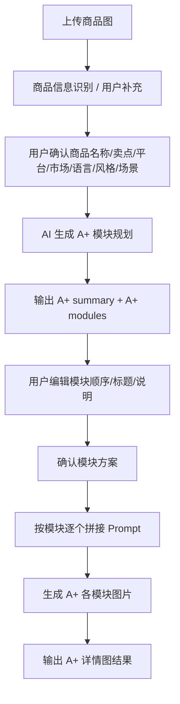

# A+详情图-完整产品方案与配置文档

> 文档目标：沉淀 `A+详情图（set-aplus）` 功能的完整可落地方案，供产品、研发、算法、运营配置直接使用。  
> 适用范围：A+详情页模块规划、模块生成、图文结构推荐、平台/品类适配、Prompt 组装。  
> 更新时间：2026-05-06

---

## 1. 文档范围

本文档统一覆盖以下内容：

1. 产品目标与业务边界
2. 真实页面流程与当前实现逻辑
3. 数据结构与接口建议
4. A+模块库设计
5. 平台、品类、市场、语言、风格规则
6. A+模块推荐与排序逻辑
7. Prompt 设计与拼接规则
8. 异常与边界方案
9. 配置表设计建议
10. 研发落地建议

---

## 2. 功能目标

A+详情图不是“多张商品图集合”，而是围绕同一商品输出一组适合详情页编排的内容模块。它的重点不是单张图的点击率，而是：

- 讲清商品价值
- 强化卖点逻辑
- 形成完整详情页叙事
- 适配平台详情内容位

目标模块通常包括：

- 首屏主视觉
- 核心卖点图
- 使用场景图
- 细节工艺图
- 参数图
- 品牌 / 故事图

---

## 3. 真实业务逻辑（Source of Truth）

### 3.1 工具配置

来自前端代码 `src/App.tsx`：

- 工具 key：`set-aplus`
- 面板标题：`A+详情图`
- 结果数量：`6`
- 默认比例展示：`1:1`

### 3.2 页面真实流程

结合页面实现和共享套图骨架，当前真实流程为：

1. 上传商品图
2. 选择创作模式
3. 配置高级设置
4. 填写补充说明
5. 进入 A+ 模块规划
6. AI 生成模块方案
7. 用户可编辑模块顺序和文案
8. 确认后生成 A+ 详情图模块

### 3.3 A+ 规划状态

当前实现中存在以下状态：

- `idle`
- `generating`
- `ready`

对应结构：

```ts
type AplusPlanStatus = "idle" | "generating" | "ready";

type AplusPlanModule = {
  id: string;
  category: string;
  headline: string;
  lines: string[];
};

type AplusPlanState = {
  status: AplusPlanStatus;
  signature?: string;
  summary?: string[];
  modules: AplusPlanModule[];
  expanded?: boolean;
  updatedAt?: number;
};
```

### 3.4 A+ 模块规划依赖的真实字段

从 `buildAplusPlanSummary` 和 `buildAplusPlanModules` 可确认当前规划逻辑主要依赖：

- `setPackProductName`
- `setPackSellingPoints`
- `setPackPlatform`
- `setPackVisualStyle`
- `setPackLanguage`
- `setPackMarket`
- `setPackScenario`

说明：

A+详情图已经天然偏“结构化商品信息驱动”，不是只靠上传图片直接出图。

---

## 4. 当前 A+ 模块库（来自真实代码）

来自 `src/App.tsx` 中的 `aplusModuleLibrary`：

1. `aplus-hero`
   - 类别：`首屏主视觉`
   - 描述：`传递核心价值`
   - tag：`首屏模块`
   - 默认比例：`3:4`
   - 默认分辨率：`1K`

2. `aplus-core-selling`
   - 类别：`核心卖点图`
   - 描述：`突出差异优势`
   - tag：`卖点模块`
   - 默认比例：`3:4`
   - 默认分辨率：`1K`

3. `aplus-scene-usage`
   - 类别：`使用场景图`
   - 描述：`呈现真实使用场景`
   - tag：`场景模块`
   - 默认比例：`3:4`
   - 默认分辨率：`1K`

4. `aplus-detail`
   - 类别：`细节工艺图`
   - 描述：`放大关键质感细节`
   - tag：`细节模块`
   - 默认比例：`3:4`
   - 默认分辨率：`1K`

5. `aplus-parameter`
   - 类别：`规格参数图`
   - 描述：`参数信息清晰展示`
   - tag：`参数模块`
   - 默认比例：`3:4`
   - 默认分辨率：`1K`

6. `aplus-brand-story`
   - 类别：`品牌故事图`
   - 描述：`表达品牌理念与气质`
   - tag：`品牌模块`
   - 默认比例：`3:4`
   - 默认分辨率：`1K`

> 说明：前端代码片段中 `aplusModuleLibrary` 被截断显示，但从模块生成逻辑和页面语义可以明确当前 A+ 至少围绕以上 6 类模块展开。

---

## 5. A+ 功能与电商套图的关键差异

### 5.1 电商套图

- 目标：生成一组可单独使用的商品图片
- 重点：主图、卖点图、场景图、活动图等
- 核心是“图片集合”

### 5.2 A+详情图

- 目标：生成一组有阅读顺序的详情页内容模块
- 重点：模块叙事、图文节奏、卖点层级、模块顺序
- 核心是“详情页内容结构”

结论：

A+ 不只是“多张图推荐”，它还需要：

- 模块顺序规划
- 模块标题和说明生成
- 详情页结构性阅读逻辑

---

## 6. A+ 完整业务流程



---

## 7. A+ 数据结构建议

### 7.1 规划输入结构

```json
{
  "session_id": "string",
  "source_uploads": [],
  "product_info": {
    "product_name": "",
    "selling_points": [],
    "platform": "",
    "market": "",
    "language": "",
    "visual_style": "",
    "scenario": ""
  },
  "supplement": ""
}
```

### 7.2 A+ 规划输出结构

```json
{
  "status": "ready",
  "signature": "",
  "summary": [],
  "modules": [
    {
      "id": "aplus-hero",
      "category": "首屏主视觉",
      "description": "",
      "headline": "",
      "focus_line": "",
      "visual_line": "",
      "module_payload": {}
    }
  ]
}
```

### 7.3 A+ 生成结果结构

```json
{
  "selection_context": {
    "platform": "",
    "market": "",
    "language": "",
    "visual_style": "",
    "category_key": ""
  },
  "aplus_modules": [],
  "prompts_by_module": []
}
```

---

## 8. A+ 模块规划逻辑

### 8.1 规划输入字段的真实语义

#### `setPackProductName`

- 商品名称
- 作为所有模块的主题核心

#### `setPackSellingPoints`

- 多行卖点文本
- 用于：
  - summary 生成
  - 模块重点提炼
  - headline 与 lines 生成

#### `setPackPlatform`

- A+ 目标平台
- 决定：
  - 详情页阅读逻辑
  - 平台允许的图文密度
  - 是否偏品牌化还是偏转化

#### `setPackVisualStyle`

- 视觉风格
- 决定模块整体气质

#### `setPackLanguage`

- 输出语言
- 影响标题写法和说明长度

#### `setPackMarket`

- 目标市场
- 决定审美和阅读节奏

#### `setPackScenario`

- 使用场景
- 主要影响：
  - 使用场景图
  - 首屏主视觉
  - 品牌故事图

---

## 9. A+ 模块推荐策略

建议把 A+ 模块推荐拆成 3 层：

1. `must_have_modules`
2. `recommended_modules`
3. `optional_modules`

为了方便开发理解，建议把这 3 层与现有配置做如下对应：

### 9.0 配置对应关系

#### 1. `must_have_modules`

- 含义：当前商品/品类下，优先级最高、默认应进入规划结果的模块。
- 当前配置中**没有单独落字段**。
- 当前实现建议：
  - 基础默认必选集合可作为代码常量维护，例如：
    - `aplus-hero`
    - `aplus-core-selling`
    - `aplus-detail`
  - 再叠加 `aplus_category_rules.json` 中对应品类的 `recommended_modules`
  - 再叠加 `aplus_platform_rules.json` 中当前平台下 `priority` 较高的模块做排序或补强
- 也就是说，现阶段 `must_have_modules` 更接近“规则引擎计算结果”，不是某个配置文件里的现成字段。

#### 2. `recommended_modules`

- 含义：适合当前品类优先进入规划方案的模块集合。
- 对应配置：
  - `aplus_category_rules.json` -> `recommended_modules`
- 用法：
  - 开发在拿到品类后，先读取该字段，作为模块推荐主集合。

#### 3. `optional_modules`

- 含义：该品类可用，但不是强推荐，可在模块数量不足或需要补充表达时再加入的模块。
- 当前配置中**没有单独落字段**。
- 当前实现建议：
  - 通过下面公式计算：

```text
optional_modules =
applicable_modules
- recommended_modules
- forbidden_modules
```

- 对应配置：
  - `aplus_category_rules.json` -> `applicable_modules`
  - `aplus_category_rules.json` -> `recommended_modules`
  - `aplus_category_rules.json` -> `forbidden_modules`

#### 4. 平台规则如何参与

- `aplus_platform_rules.json` 不直接产出 `must_have_modules / recommended_modules / optional_modules`
- 它的作用是：
  - 过滤某个平台是否允许某模块：`is_allowed`
  - 对允许模块做平台内排序：`priority`
  - 给模块补平台说明与限制：`platform_notes`、`platform_constraints`

因此更准确的推荐流程应为：

```text
第一步：按品类规则取模块池
- recommended_modules
- optional_modules

第二步：按平台规则过滤
- 仅保留 is_allowed = true 的模块

第三步：按平台 priority 排序
- 让不同平台下的模块顺序更符合平台语境

第四步：与默认 must-have 合并
- 保证首屏、核心卖点、细节等基础模块优先出现
```

如果后续希望配置表达更直接，建议把 `aplus_category_rules.json` 显式升级为：

```json
{
  "category_key": "",
  "must_have_modules": [],
  "recommended_modules": [],
  "optional_modules": [],
  "forbidden_modules": []
}
```

这样开发无需再通过 `applicable - recommended - forbidden` 做推导。

### 9.1 默认 must have

适合绝大多数商品：

- `首屏主视觉`
- `核心卖点图`
- `细节工艺图`

### 9.2 根据品类追加

#### 服饰鞋包

- `使用场景图`
- `细节工艺图`
- `版型说明图`（建议新增）

#### 3C / 家电

- `规格参数图`
- `功能拆解图`（建议新增）

#### 家居 / 家具

- `使用场景图`
- `空间适配图`（建议新增）

#### 工业品 / 1688 / 阿里国际站

- `规格参数图`
- `工艺细节图`
- `应用场景图`

### 9.3 根据平台追加

#### Amazon A+

- 首屏主视觉
- 核心卖点图
- 规格参数图
- 场景图

#### 小红书电商详情

- 首屏主视觉
- 使用场景图
- 细节工艺图

#### 1688 / 阿里国际站

- 规格参数图
- 工艺图
- 应用场景图

### 9.4 配置对应与获取方式

`根据平台追加` 对应配置文件：

- `aplus_platform_rules.json`

该配置不是按“一个平台对应一整组模块列表”直接存储，而是按以下粒度落库：

```json
{
  "platform": "",
  "module_key": "",
  "is_allowed": true,
  "priority": 90,
  "platform_notes": "",
  "platform_constraints": []
}
```

也就是说，平台规则是 `platform + module_key` 这一对关系的集合。

开发侧建议按以下方式获取：

```text
1. 读取前端当前选择的平台
2. 从 aplus_platform_rules.json 中筛出 platform = 当前平台 的记录
3. 过滤 is_allowed = true 的模块
4. 按 priority 从高到低排序
5. 将排序靠前的模块作为“根据平台追加”的优先候选
```

如果要和品类推荐一起使用，建议主流程为：

```text
第一步：从 aplus_category_rules.json 取当前品类的
- recommended_modules
- optional_modules

第二步：从 aplus_platform_rules.json 取当前平台下
- is_allowed = true 的模块

第三步：对“品类模块池”和“平台允许模块”取交集

第四步：按平台 priority 排序

第五步：将高 priority 模块作为平台追加推荐结果
```

字段作用说明：

- `is_allowed`
  - 表示该模块在当前平台下是否允许进入候选池
- `priority`
  - 表示该模块在当前平台下的推荐优先级，数值越高越靠前
- `platform_notes`
  - 用于解释为什么这个平台适合该模块
- `platform_constraints`
  - 用于补充 prompt 约束或生成时的注意事项

因此：

- `aplus_category_rules.json` 决定“这个品类适合哪些模块”
- `aplus_platform_rules.json` 决定“这些模块在这个平台上能不能用，以及谁优先”

---

## 10. A+ 模块类型库建议

在真实实现基础上，建议扩展为以下标准模块库：

### 10.1 基础模块

- `aplus-hero` 首屏主视觉
- `aplus-core-selling` 核心卖点图
- `aplus-scene-usage` 使用场景图
- `aplus-detail` 细节工艺图
- `aplus-parameter` 规格参数图
- `aplus-brand-story` 品牌故事图

### 10.2 建议新增模块

- `aplus-fit` 版型说明图
- `aplus-function` 功能拆解图
- `aplus-space-fit` 空间适配图
- `aplus-audience` 适用人群图
- `aplus-comparison` 对比说明图

---

## 11. A+ 配置表建议

建议独立于电商套图，单独建 4 张表。

### 11.0 开发读取对照

为了方便开发联调，当前 A+ 相关字段与配置文件的对应关系建议明确为：

| 业务字段 / 规则层 | 配置文件 | 读取方式 |
|---|---|---|
| 模块基础定义 | `aplus_module_definitions.json` | 按 `module_key` 读取模块名称、简介、基础 prompt、默认比例等 |
| 品类模块推荐 | `aplus_category_rules.json` | 按 `category_key` 读取 `applicable_modules / recommended_modules / forbidden_modules` |
| 平台模块限制与排序 | `aplus_platform_rules.json` | 按 `platform + module_key` 读取 `is_allowed / priority / platform_notes / platform_constraints` |
| 平台值级 prompt | `aplus_market_field_value_prompts.json` -> `fields.platform.prompts` | 按前端选择的 `平台文案值` 直接读取对应提示词 |
| 市场值级 prompt | `aplus_market_field_value_prompts.json` -> `fields.market.prompts` | 按前端选择的 `目标市场` 直接读取对应提示词 |
| 语言值级 prompt | `aplus_market_field_value_prompts.json` -> `fields.copy_language.prompts` | 按前端选择的 `文案语种` 直接读取对应提示词 |
| 视觉风格值级 prompt | `aplus_market_field_value_prompts.json` -> `fields.visual_style.prompts` | 按前端选择的 `视觉风格` 直接读取对应提示词 |
| 市场 / 语言 / 风格组合增强 | `aplus_market_visual_rules.json` | 当前可作为可选增强层；若无特殊组合规则，可不参与主流程 |

当前建议主流程如下：

```text
1. 从 aplus_module_definitions.json 拿完整模块库
2. 从 aplus_category_rules.json 拿当前品类的 recommended / optional / forbidden
3. 从 aplus_platform_rules.json 过滤当前平台下 is_allowed=false 的模块，并按 priority 排序
4. 从 aplus_market_field_value_prompts.json 按平台 / 市场 / 语言 / 风格分别读取独立 prompt
5. 将模块基础 prompt + 品类 patch + 平台 patch + 独立字段 value prompt 拼接成最终规划/出图 prompt
```

补充说明：

- `platform / market / copy_language / visual_style` 当前都应视为**独立单选字段**
- 它们的值级提示词统一从 `aplus_market_field_value_prompts.json` 读取，不应互相依赖
- `aplus_market_visual_rules.json` 仅在确实存在“组合增强逻辑”时再使用，不应承担独立字段值映射职责

### 11.1 `aplus_module_definitions`

字段建议：

- `module_key`
- `module_name`
- `module_category`
- `module_description`
- `base_prompt_template`
- `base_negative_prompt`
- `default_layout_guidance`
- `default_text_guidance`

### 11.2 `aplus_platform_rules`

字段建议：

- `platform`
- `module_key`
- `is_allowed`
- `priority`
- `platform_notes`
- `platform_constraints`

### 11.3 `aplus_category_rules`

字段建议：

- `category_key`
- `applicable_modules`
- `recommended_modules`
- `forbidden_modules`
- `display_focus_rules`
- `prompt_patch_rules`
- `risk_rules`

### 11.4 `aplus_market_visual_rules`

字段建议：

- `market`
- `language`
- `visual_style`
- `layout_preference`
- `copy_density`
- `headline_style`
- `module_bias`

### 11.5 `aplus_market_field_value_prompts`（市场配置字段值提示词映射）

用途：

- 对 `市场配置` 4 个字段做值级别 Prompt 扩展；
- 解决“只有选项值，没有可执行提示词”的问题；
- 在 A+ 规划和模块 Prompt 拼接时直接引用。

字段范围（对应前端 `set-aplus` 市场配置）：

- `platform`（目标平台）
- `market`（目标市场）
- `copy_language`（文案语种）
- `visual_style`（视觉风格）

建议结构：

```json
{
  "field_key": "visual_style",
  "field_value": "简约清新风",
  "value_prompt": "整体画面干净通透、留白充足、色彩轻盈柔和，减少厚重装饰和强对比元素，突出自然、舒适、清爽、有呼吸感的详情页视觉。",
  "priority": 90,
  "enabled": true
}
```

关键示例（需完整落库，不只示例）：

1. `visual_style=简约清新风`
   - `value_prompt`：整体画面干净通透、留白充足、色彩轻盈柔和，减少厚重装饰和强对比元素，突出自然、舒适、清爽、有呼吸感的详情页视觉。
2. `visual_style=高级质感风`
   - `value_prompt`：整体画面强调材质细节、光影层次和品牌感，色彩克制，版式精致，突出高客单感、品质感和专业审美。
3. `market=北美`
   - `value_prompt`：符合北美市场偏好，强调简洁层级、留白、真实质感和理性价值表达，避免信息过载。
4. `copy_language=英文`
   - `value_prompt`：使用简洁自然的英文标题与说明，避免中式英文，控制句长，强调清晰和专业。
5. `platform=亚马逊`
   - `value_prompt`：适配 Amazon A+ 内容语境，强调信息结构清晰、品牌表达克制、卖点与参数真实可信，不做强促销海报感。

---

## 12. A+ Prompt 设计原则

与电商套图相比，A+ Prompt 要多一层：

- 模块内文字结构控制

### 12.1 拼接公式

```text
最终 Prompt =
[模块基础 Prompt]
+ [品类 Patch]
+ [平台 Patch]
+ [市场 / 语言 / 风格 Patch]
+ [模块 headline / focus_line / visual_line]
+ [用户补充要求]
```

### 12.2 为什么 A+ 需要 `headline / focus_line / visual_line`

因为 A+ 不是只生成画面氛围，还要考虑：

- 这个模块上要写什么标题
- 要配什么说明句
- 信息层级如何安排

### 12.3 开发版 Prompt 拼接说明

为了便于开发落地，建议把 A+ 相关 Prompt 明确拆成两类：

1. `模块规划 Prompt`
2. `最终生成 Prompt`

两者的职责不同：

- `模块规划 Prompt`
  - 用于根据用户输入信息，先决定要输出哪些模块、顺序如何、每个模块的 `headline / focus_line / visual_line` 应该怎么写
- `最终生成 Prompt`
  - 用于对单个模块真正出图，输入为“模块规划结果 + 模块配置 + 平台/品类/独立字段 prompt patch”

#### A. 模块规划 Prompt 的输入来源

| 输入项 | 来源 | 说明 |
|---|---|---|
| `product_name` | 用户输入 `setPackProductName` | 商品名称 |
| `selling_points` | 用户输入 `setPackSellingPoints` | 核心卖点，可拆成 `primary_selling_point / secondary_selling_point` |
| `audience` | 用户输入 `setPackAudience` | 目标人群，建议参与 headline / 模块顺序决策 |
| `scenario` | 用户输入 `setPackScenario` | 使用场景 |
| `parameters_or_concerns` | 用户输入 `setPackParameters` | 规格、参数、顾虑、补充说明 |
| `platform` | 前端市场配置选择值 | 对应 `aplus_market_field_value_prompts.json -> fields.platform.prompts[平台值]` |
| `market` | 前端市场配置选择值 | 对应 `aplus_market_field_value_prompts.json -> fields.market.prompts[市场值]` |
| `copy_language` | 前端市场配置选择值 | 对应 `aplus_market_field_value_prompts.json -> fields.copy_language.prompts[语种值]` |
| `visual_style` | 前端市场配置选择值 | 对应 `aplus_market_field_value_prompts.json -> fields.visual_style.prompts[风格值]` |
| `category_rules` | `aplus_category_rules.json` | 取 `recommended_modules / forbidden_modules / prompt_patch_rules / display_focus_rules / risk_rules` |
| `platform_rules` | `aplus_platform_rules.json` | 取当前平台下各模块的 `is_allowed / priority / platform_notes / platform_constraints` |
| `module_library` | `aplus_module_definitions.json` | 取所有模块的 `module_key / module_name / module_description / module_category` 作为候选模块库 |

#### B. 模块规划 Prompt 建议拼接公式

```text
模块规划 Prompt =
[用户输入基础信息]
+ [品类模块推荐规则]
+ [平台模块过滤与排序规则]
+ [平台值级 Prompt]
+ [市场值级 Prompt]
+ [语言值级 Prompt]
+ [视觉风格值级 Prompt]
+ [用户补充要求]
```

#### C. 模块规划 Prompt 建议模板

```text
请基于以下商品信息，为 A+详情页生成一份模块规划方案。

【商品基础信息】
- 商品名称：{product_name}
- 核心卖点：{selling_points}
- 目标人群：{audience}
- 使用场景：{scenario}
- 参数/顾虑/补充：{parameters_or_concerns}

【市场配置】
- 目标平台：{platform}
- 平台要求：{platform_value_prompt}
- 目标市场：{market}
- 市场要求：{market_value_prompt}
- 文案语种：{copy_language}
- 语种要求：{copy_language_value_prompt}
- 视觉风格：{visual_style}
- 风格要求：{visual_style_value_prompt}

【品类规则】
- 推荐模块：{category_recommended_modules}
- 可用模块：{category_applicable_modules}
- 禁用模块：{category_forbidden_modules}
- 展示重点：{category_display_focus_rules}
- 品类补充规则：{category_prompt_patch_rules}
- 风险限制：{category_risk_rules}

【平台规则】
- 当前平台允许模块：{platform_allowed_modules}
- 当前平台高优先级模块：{platform_priority_sorted_modules}
- 平台补充说明：{platform_notes_summary}
- 平台限制：{platform_constraints_summary}

【独立字段值级 Prompt】
- 平台值级 Prompt：{platform_value_prompt}
- 市场值级 Prompt：{market_value_prompt}
- 语言值级 Prompt：{copy_language_value_prompt}
- 风格值级 Prompt：{visual_style_value_prompt}

要求：
1. 输出适合 A+详情页的 summary
2. 输出 4-6 个模块
3. 模块必须从标准模块库中选择
4. 每个模块输出：
- id
- category
- description
- headline
- focus_line
- visual_line
- module_payload
5. 若模块在 `aplus_module_definitions.json` 中存在 `payload_schema`，则必须按该 schema 输出 `module_payload`
6. 模块顺序需符合详情页阅读逻辑
7. 不得使用 forbidden_modules
8. 优先考虑 recommended_modules 与当前平台下高 priority 模块
9. 不要虚构商品事实、参数、成分、功能和服务承诺
```

#### D. 最终生成 Prompt 的输入来源

| 输入项 | 来源 | 说明 |
|---|---|---|
| `module_key` | 模块规划结果 `modules[].id` | 当前要生成的模块 id |
| `description` | 模块规划结果 `modules[].description` | 规划阶段产出的模块简介 |
| `headline` | 模块规划结果 `modules[].headline` | 规划阶段产出的主标题 |
| `focus_line` | 模块规划结果 `modules[].focus_line` | 规划阶段产出的模块重点 |
| `visual_line` | 模块规划结果 `modules[].visual_line` | 规划阶段产出的视觉建议 |
| `module_payload` | 模块规划结果 `modules[].module_payload` | 规划阶段产出的模块专属字段值 |
| `base_prompt_template` | `aplus_module_definitions.json` | 按 `module_key` 读取 |
| `base_negative_prompt` | `aplus_module_definitions.json` | 按 `module_key` 读取 |
| `default_layout_guidance` | `aplus_module_definitions.json` | 按 `module_key` 读取 |
| `default_text_guidance` | `aplus_module_definitions.json` | 按 `module_key` 读取 |
| `payload_schema` | `aplus_module_definitions.json` | 按 `module_key` 读取，用于校验 `module_payload` |
| `payload_prompt_template` | `aplus_module_definitions.json` | 按 `module_key` 读取，用于拼模块专属 Prompt |
| `platform_notes / platform_constraints` | `aplus_platform_rules.json` | 按 `platform + module_key` 读取 |
| `category_prompt_patch_rules / risk_rules` | `aplus_category_rules.json` | 按 `category_key` 读取 |
| `platform_value_prompt` | `aplus_market_field_value_prompts.json -> fields.platform.prompts` | 按平台值读取 |
| `market_value_prompt` | `aplus_market_field_value_prompts.json -> fields.market.prompts` | 按市场值读取 |
| `copy_language_value_prompt` | `aplus_market_field_value_prompts.json -> fields.copy_language.prompts` | 按语种值读取 |
| `visual_style_value_prompt` | `aplus_market_field_value_prompts.json -> fields.visual_style.prompts` | 按风格值读取 |
| `combination_patch` | `aplus_market_visual_rules.json` | 可选；仅当有组合增强规则时使用 |

#### E. 最终生成 Prompt 建议拼接公式

```text
最终生成 Prompt =
[模块基础 Prompt Template]
+ [模块默认版式 Guidance]
+ [模块默认文案 Guidance]
+ [品类 Prompt Patch]
+ [平台 Notes / Constraints Patch]
+ [平台值级 Prompt]
+ [市场值级 Prompt]
+ [语言值级 Prompt]
+ [视觉风格值级 Prompt]
+ [模块 headline]
+ [模块 focus_line]
+ [模块 visual_line]
+ [模块 payload_prompt_template]
+ [用户补充要求]
```

#### F. 最终生成 Prompt 建议模板

```text
请为商品“{product_name}”生成一张 A+详情页模块图。

【当前模块】
- 模块ID：{module_key}
- 模块名称：{module_name}
- 模块类型：{module_category}
- 模块简介：{module_description}

【模块基础要求】
{base_prompt_template}

【模块版式要求】
- 默认版式建议：{default_layout_guidance}
- 默认文案结构：{default_text_guidance}

【规划结果】
- 模块标题：{headline}
- 模块说明：{description}
- 模块重点：{focus_line}
- 视觉建议：{visual_line}

【模块专属字段】
{module_payload_prompt}

【品类补丁】
- 品类重点：{category_display_focus_rules}
- 品类补充要求：{category_prompt_patch_rules}
- 风险限制：{category_risk_rules}

【平台补丁】
- 平台说明：{platform_notes}
- 平台限制：{platform_constraints}

【独立字段 Prompt】
- 平台值 Prompt：{platform_value_prompt}
- 市场值 Prompt：{market_value_prompt}
- 语言值 Prompt：{copy_language_value_prompt}
- 风格值 Prompt：{visual_style_value_prompt}

【补充要求】
- 目标人群：{audience}
- 使用场景：{scenario}
- 其他补充：{parameters_or_concerns}

【负向约束】
{base_negative_prompt}
```

补充说明：

- `headline / focus_line / visual_line` 应优先来自模块规划结果，而不是在最终出图阶段重新自由发挥
- 平台、市场、语言、视觉风格当前都应从 `aplus_market_field_value_prompts.json` 按值独立读取
- `aplus_market_visual_rules.json` 只有在存在“组合额外 patch”时才参与最终拼接
- 若用户未填写 `audience`，可不阻塞主流程，但建议不再在 Prompt 中虚构具体人群画像

### 12.4 推荐结果字段与最终 Prompt 的对应关系

当前功能中，A+ 模块规划结果里，模块卡片通常会展示这些信息：

- 类型
- 简介
- 内部提示词
  - 主标题
  - 模块重点
  - 视觉建议

为了避免开发侧混淆，建议明确以下对应关系。

#### A. 推荐结果字段来源

| 推荐结果展示项 | 当前结果字段 | 来源 | 说明 |
|---|---|---|---|
| 类型 | `category` | 模块规划结果 | 例如：首屏主视觉、核心卖点图、规格参数图 |
| 简介 | `description` 或 `module_description` | `aplus_module_definitions.json -> module_description` | 建议作为模块说明展示，不建议充当最终主标题 |
| 主标题 | `headline` | 模块规划结果 | 真正用于约束该模块标题表达的动态文案 |
| 模块重点 | `focus_line` | 模块规划结果 | 用于说明该模块核心表达重点 |
| 视觉建议 | `visual_line` | 模块规划结果 | 用于说明画面风格、排版和视觉节奏 |

补充说明：

- 推荐的新结构应固定为：
  - `category`
  - `description`
  - `headline`
  - `focus_line`
  - `visual_line`
- 避免再通过 `lines[]` 的顺序语义判断字段含义。

#### B. 推荐结果字段与最终 Prompt 字段映射

| 推荐结果字段 | 最终 Prompt 中的角色 | 如何使用 |
|---|---|---|
| `category` | 模块类型定位 | 用于确定当前模块属于哪一类模块，并回查 `module_key / module_name / module_category` |
| `description` | 模块辅助说明 | 可用于 UI 展示或轻量补充，不建议作为核心强约束 |
| `headline` | 模块主标题 | 应直接拼入最终 Prompt，告诉模型该模块的标题表达方向 |
| `focus_line` / 模块重点 | 模块核心表达目标 | 应直接拼入最终 Prompt，作为模块重点约束 |
| `visual_line` / 视觉建议 | 模块视觉层约束 | 应直接拼入最终 Prompt，和风格值级 Prompt 一起控制视觉表现 |

#### C. 最终生成 Prompt 建议对应关系

```text
最终模块 Prompt =
[模块基础 Prompt Template]
+ [模块默认版式 Guidance]
+ [模块默认文案 Guidance]
+ [品类 Patch]
+ [平台 Patch]
+ [平台 / 市场 / 语言 / 风格独立值 Prompt]
+ [推荐结果中的主标题]
+ [推荐结果中的模块重点]
+ [推荐结果中的视觉建议]
+ [用户补充要求]
+ [负向约束]
```

其中推荐结果中的值建议这样对应：

```text
推荐结果.category
-> 决定当前使用哪个 module_key，对应读取哪个模块定义

推荐结果.description
-> 对应模块辅助说明，可展示，不强制进入最终 Prompt 主体

推荐结果.headline
-> 最终 Prompt 中的“模块主标题”

推荐结果.focus_line
-> 最终 Prompt 中的“模块重点”

推荐结果.visual_line
-> 最终 Prompt 中的“视觉建议”
```

#### D. 推荐给开发的数据结构

为了让“规划结果 -> 最终出图 Prompt”映射更清晰，建议模块规划结果尽量采用下面这种结构：

```json
{
  "id": "aplus-core-selling",
  "category": "核心卖点图",
  "description": "突出差异优势",
  "headline": "一眼讲清核心价值",
  "focus_line": "围绕核心卖点和用户收益展开，突出差异化优势与购买理由。",
  "visual_line": "保持信息分区清晰，商品主体突出，图文节奏紧凑有重点。"
}
```

这样最终 Prompt 拼接时可以直接对应：

- `description` -> 模块说明
- `headline` -> 主标题
- `focus_line` -> 模块重点
- `visual_line` -> 视觉建议

而不是再从一个 `lines[]` 数组里依赖顺序判断语义。

#### E. 模块编辑态结构约束与校验方案

为了保证“AI 规划结果 -> 用户编辑 -> 最终出图 Prompt”三段链路使用同一套结构，建议用户编辑时只允许修改结构内字段值，不允许自由改写整体结构。

##### 1. 编辑态字段约束

前端模块编辑卡片建议固定为以下字段：

- `id`
- `category`
- `description`
- `headline`
- `focus_line`
- `visual_line`

字段编辑权限建议如下：

- `id`：仅允许通过标准模块库下拉切换，不允许自由输入
- `category`：由 `id` 自动映射，前端只读，不允许手改
- `description`：允许编辑
- `headline`：允许编辑
- `focus_line`：允许编辑
- `visual_line`：允许编辑

这样可以避免出现“模块类型已换，但 category 还是旧值”或“前端写回了一套非标准字段”的结构漂移问题。

##### 2. 编辑态 JSON Schema 建议

建议保存前对 `modules` 做严格 schema 校验：

```json
{
  "type": "array",
  "minItems": 1,
  "items": {
    "type": "object",
    "additionalProperties": false,
    "required": [
      "id",
      "category",
      "description",
      "headline",
      "focus_line",
      "visual_line"
    ],
    "properties": {
      "id": {
        "type": "string",
        "enum": [
          "aplus-hero",
          "aplus-core-selling",
          "aplus-scene-usage",
          "aplus-multi-angle",
          "aplus-atmosphere",
          "aplus-detail",
          "aplus-fit",
          "aplus-function",
          "aplus-space-fit",
          "aplus-audience",
          "aplus-compare",
          "aplus-brand-story",
          "aplus-size",
          "aplus-comparison",
          "aplus-spec",
          "aplus-craft",
          "aplus-accessories",
          "aplus-series",
          "aplus-ingredient",
          "aplus-after-sale",
          "aplus-usage-advice"
        ]
      },
      "category": {
        "type": "string",
        "minLength": 1
      },
      "description": {
        "type": "string",
        "minLength": 1,
        "maxLength": 60
      },
      "headline": {
        "type": "string",
        "minLength": 1,
        "maxLength": 40
      },
      "focus_line": {
        "type": "string",
        "minLength": 1,
        "maxLength": 120
      },
      "visual_line": {
        "type": "string",
        "minLength": 1,
        "maxLength": 120
      }
    }
  }
}
```

说明：

- `additionalProperties=false`：防止前端把临时字段、富文本块、调试字段直接写回
- `id.enum`：必须来自标准模块库
- 文案长度建议限制在适合最终 Prompt 拼接和前端卡片展示的范围内

##### 3. 保存前 normalize 建议

即使前端已校验，保存前仍建议统一做一层 normalize：

1. trim 所有字符串首尾空格
2. 连续空白折叠为单空格
3. `id` 变更后，按模块库自动回填 `category`
4. 空字符串视为未填写，不允许保存
5. 若历史数据仍为 `headline + lines[]` 结构，保存时统一转换为：
   - `lines[0]` -> `description`
   - `lines[1]` -> `focus_line`
   - `lines[2]` -> `visual_line`

这样可以确保编辑后的落库结构统一，不受历史版本影响。

##### 4. 前端校验与服务端校验分层

建议明确区分两类问题：

结构错误：

- 缺字段
- 字段类型错误
- 出现未定义字段
- `id` 不在标准模块库中
- `category` 与 `id` 不匹配

内容错误：

- `headline` 过长
- `focus_line` 写成参数表堆砌
- `visual_line` 缺少视觉结构描述
- 文案为空或过度重复

处理建议：

- 结构错误：禁止保存
- 内容错误：允许提示并引导修改，必要时给出 AI 重写入口

##### 5. 服务端最终一致性校验

真正保证结构一致性，必须以后端入库校验为准。

服务端建议在保存接口执行以下规则：

1. 用 schema 校验 `modules`
2. 根据 `id` 到 `aplus_module_definitions.json` 校验模块是否存在
3. 根据 `id` 自动反查标准 `module_name / module_category`，校验 `category` 是否匹配
4. 根据当前 `category_key` 校验该模块是否出现在 `forbidden_modules`
5. 根据当前 `platform` 校验该模块是否 `is_allowed=false`
6. 校验通过后，返回规范化后的结构，而不是原始前端提交内容

建议后端返回：

```json
{
  "status": "ready",
  "summary": [],
  "modules": [
    {
      "id": "aplus-core-selling",
      "category": "核心卖点图",
      "description": "突出差异优势",
      "headline": "一眼讲清核心价值",
      "focus_line": "围绕核心卖点和用户收益展开，突出差异化优势与购买理由。",
      "visual_line": "保持信息分区清晰，商品主体突出，图文节奏紧凑有重点。"
    }
  ]
}
```

前端应以服务端返回结果覆盖本地草稿，避免本地结构继续漂移。

##### 6. 最终出图阶段的读取原则

最终生成 Prompt 时，禁止直接读取用户自由编辑的大段富文本说明，必须只读取结构化字段：

- `description`
- `headline`
- `focus_line`
- `visual_line`

其中：

- `headline` -> 模块主标题
- `focus_line` -> 模块重点
- `visual_line` -> 视觉建议
- `description` -> 可进入“模块简介/模块说明”，但不应替代 headline 的职责

这样可以确保编辑态、存储态、出图态三段结构保持一致。

##### 7. 推荐的模块编辑交互

建议模块编辑 UI 遵循下面原则：

1. 模块顺序允许拖拽
2. 模块类型允许通过标准模块库切换
3. 切换模块类型时，提示是否同步替换为该模块默认结构建议
4. `category` 自动只读
5. 对 `headline / focus_line / visual_line` 做字数提示和语义提示
6. 提供“恢复 AI 初稿”与“AI 帮我润色”两个操作，但生成结果仍需回写到同一结构中

核心原则不是限制用户编辑，而是限制“编辑的形状”。

#### F. 不同模块类型的差异化结构适配

统一结构只适合承载“所有模块都共有的信息”，但不适合承载“某些模块才有的专属表达”。

例如：

- `aplus-multi-angle` 多角度图，天然会有“角度标签列表”
- `aplus-scene-usage` 使用场景图，天然会有“主标题位置、字体风格、语言要求”
- `aplus-spec` 参数图，天然会有“参数表字段列表”
- `aplus-comparison` 对比图，天然会有“对比项列表”

因此建议采用：

`统一公共结构 + 模块专属扩展结构`

而不是继续把所有模块都压进同一套 `headline / focus_line / visual_line` 里。

##### 1. 建议的数据分层

建议模块编辑结果升级为两层：

```json
{
  "id": "aplus-multi-angle",
  "category": "多角度展示图",
  "description": "通过多个视角展示外观结构",
  "headline": "多角度看清产品结构",
  "focus_line": "突出正面、侧面、背面和关键细节，帮助用户快速理解商品全貌。",
  "visual_line": "采用宫格构图，主次分明，标签清晰，商品角度保持一致。",
  "module_payload": {
    "angle_labels": [
      "Front View",
      "Side View",
      "Back View",
      "Cuff Detail"
    ],
    "label_style": "纯文字小标签",
    "grid_count": 4
  }
}
```

说明：

- 第一层公共字段继续用于排序、卡片展示、通用 Prompt 拼接
- `module_payload` 专门承载不同模块独有的结构化内容

##### 2. 为什么不能只靠统一字段

如果继续只用统一字段：

- 多角度图里的 `Front View / Side View / Back View` 会被塞进一段普通文案，后续难以精确拼 Prompt
- 使用场景图里的“主标题位置、字体、字号、语言”会被写成一句自由文本，前端无法结构化编辑
- 参数图、对比图、流程图会越来越依赖“从自然语言里二次解析”，后续稳定性会很差

所以统一结构只负责“共性”，模块特有信息必须结构化。

##### 3. 建议保留的公共字段

所有模块统一保留：

- `id`
- `category`
- `description`
- `headline`
- `focus_line`
- `visual_line`
- `module_payload`

其中：

- `headline`：模块主标题或主表达主题
- `focus_line`：模块内容重点
- `visual_line`：通用视觉方向
- `module_payload`：模块专属字段

##### 4. module_payload 的设计方式

不建议做成“任意 JSON”，而建议按 `module_key` 维护独立 schema。

例如：

`aplus-multi-angle`：

```json
{
  "angle_labels": ["Front View", "Side View", "Back View", "Cuff Detail"],
  "label_style": "纯文字小标签",
  "grid_count": 4
}
```

`aplus-scene-usage`：

```json
{
  "title_text": "Perfect For Daily Commute",
  "title_position": "left-top",
  "title_font_style": "medium-rounded-sans",
  "title_size": "medium",
  "target_language": "en"
}
```

`aplus-spec`：

```json
{
  "spec_items": [
    { "label": "Material", "value": "Cotton Blend" },
    { "label": "Size", "value": "M / L / XL" }
  ],
  "table_style": "card-grid"
}
```

##### 5. Prompt 拼接方式也要分层

最终生成 Prompt 不应只拼一层统一文案，而应拆成：

```text
最终生成 Prompt =
[公共模块基础 Prompt]
+ [公共版式 Guidance]
+ [平台 / 市场 / 品类 Patch]
+ [公共字段 Prompt]
+ [模块专属字段 Prompt]
```

其中：

公共字段 Prompt 负责：

- `headline`
- `focus_line`
- `visual_line`

模块专属字段 Prompt 负责：

- 多角度图的标签列表、格数、标签样式
- 使用场景图的标题文本、位置、字体、字号、语言
- 参数图的参数表字段
- 对比图的对比项

##### 6. 推荐的模块专属 Prompt 组装方式

以 `aplus-multi-angle` 为例：

```text
【模块公共要求】
- 模块标题：{headline}
- 模块重点：{focus_line}
- 视觉建议：{visual_line}

【模块专属要求】
- 展示 4 个角度画面
- 标签依次为：Front View / Side View / Back View / Cuff Detail
- 标签样式：纯文字小标签
- 标签位置：每格下方
```

以 `aplus-scene-usage` 为例：

```text
【模块公共要求】
- 模块标题：{headline}
- 模块重点：{focus_line}
- 视觉建议：{visual_line}

【模块专属要求】
- 主标题文案：Perfect For Daily Commute
- 主标题排版：中等圆润无衬线体
- 主标题位置：画面左上角
- 主标题字号：中号
- 输出语言：英文
```

这样公共层仍统一，但模块层是差异化的。

##### 7. 前端编辑交互建议

前端不要给所有模块渲染同一张表单，而应采用：

1. 公共表单区
2. 模块专属表单区

例如：

- 多角度图：出现“角度标签”“标签样式”“宫格数量”
- 使用场景图：出现“主标题文案”“标题位置”“字体风格”“语言”
- 参数图：出现“参数项列表”“表格样式”

即：

- 公共字段组件是统一的
- `module_payload` 的编辑组件按 `module_key` 动态切换

##### 8. 服务端校验建议

服务端保存时不仅要校验公共字段，还要按 `module_key` 校验 `module_payload`。

建议规则：

1. 先校验公共 schema
2. 再根据 `id` 选择对应 payload schema
3. 若 payload 缺字段或字段类型错误，禁止保存
4. 若用户切换了模块类型，旧的 payload 不能直接保留，必须重置为新模块默认结构

例如：

- 从 `aplus-multi-angle` 切到 `aplus-scene-usage`
- 原来的 `angle_labels` 必须清空
- 自动换成 `title_text / title_position / title_font_style / target_language` 这一套字段

##### 9. 推荐落地方式

因此，当前结构不需要推翻，但建议升级为：

```json
{
  "id": "",
  "category": "",
  "description": "",
  "headline": "",
  "focus_line": "",
  "visual_line": "",
  "module_payload": {}
}
```

然后在配置层补两类内容：

1. 每个模块的 `payload_schema`
2. 每个模块的 `payload_prompt_template`

这样才能既保留统一框架，又适配不同模块的差异化提示词组成。

---

## 13. A+ 模块 Prompt 模板建议

### 13.1 `aplus-hero`

```text
请为商品“{product_name}”生成一张适合 A+ 详情页首屏的主视觉模块图，突出商品核心价值、品牌质感与整体视觉冲击力。围绕卖点“{primary_selling_point}”构建主标题氛围，并预留标题、副标题和品牌表达区域。整体视觉应符合 {platform} 平台详情内容语境、{market} 市场审美和 {visual_style} 风格。
```

### 13.2 `aplus-core-selling`

```text
请为商品“{product_name}”生成一张适合 A+ 详情页的核心卖点模块图，围绕卖点“{primary_selling_point}”与“{secondary_selling_point}”进行图文强化，突出商品差异化优势与用户收益。画面需兼顾商品主体和卖点说明结构。
```

### 13.3 `aplus-scene-usage`

```text
请为商品“{product_name}”生成一张适合 A+ 详情页的使用场景模块图，将商品自然融入 {scenario} 对应的真实环境中，体现商品在具体使用情境下的价值表达。画面需兼顾场景氛围和主体辨识度。
```

### 13.4 `aplus-detail`

```text
请为商品“{product_name}”生成一张适合 A+ 详情页的细节工艺模块图，重点放大展示关键细节、材质纹理、结构处理或工艺完成度，帮助用户理解商品品质感和做工差异。
```

### 13.5 `aplus-parameter`

```text
请为商品“{product_name}”生成一张适合 A+ 详情页的规格参数模块图，清晰展示尺寸、结构、材质、容量或关键参数信息。若无明确参数值，请预留规范参数展示区域，不得虚构数值。
```

### 13.6 `aplus-brand-story`

```text
请为商品“{product_name}”生成一张适合 A+ 详情页的品牌故事模块图，通过商品细节、品牌气质和视觉氛围传达品牌理念与价值感。画面应偏品牌表达，而非强促销转化。
```

---

## 14. A+ 模块规划 Prompt 建议

建议单独设计“模块规划 Prompt”，输出 `summary` 和 `modules`。

为了与前文的“推荐结果字段与最终 Prompt 对应关系”保持一致，建议这里的 `modules` 结果结构也同步使用更明确的字段，而不是继续仅依赖 `headline + lines[]`。

```text
请基于以下商品信息，为 A+详情页生成一份模块规划方案。

输入包括：
1. 商品名称
2. 核心卖点
3. 目标平台
4. 平台值级 Prompt
5. 目标市场
6. 市场值级 Prompt
7. 输出语言
8. 语言值级 Prompt
9. 视觉风格
10. 风格值级 Prompt
11. 使用场景
12. 目标人群
13. 参数/顾虑/补充说明

要求：
1. 输出适合 A+详情页的模块 summary
2. 输出 4-6 个模块
3. 每个模块包含：
- id
- category
- description
- headline
- focus_line
- visual_line
- module_payload
4. 若当前模块在 `aplus_module_definitions.json` 中存在 `payload_schema`，则必须按 schema 输出对应的 `module_payload`
5. 模块顺序要符合详情页阅读逻辑：先价值感，再卖点，再细节，再参数，再故事/补充
6. 模块规划时必须吸收平台值级、市场值级、语言值级、风格值级 Prompt 中的约束
7. 不要虚构商品事实和参数

输出结构：
{
  "status": "ready",
  "summary": [],
  "modules": [
    {
      "id": "",
      "category": "",
      "description": "",
      "headline": "",
      "focus_line": "",
      "visual_line": "",
      "module_payload": {}
    }
  ]
}
```

补充说明：

- `description`
  - 对应模块简介，建议优先来自 `aplus_module_definitions.json -> module_description`
- `headline`
  - 对应模块主标题，属于规划阶段产出的动态文案
- `focus_line`
  - 对应模块重点，描述这一模块主要要讲清什么
- `visual_line`
  - 对应视觉建议，描述这一模块应如何组织画面、排版和视觉节奏
- `module_payload`
  - 对应模块专属字段
  - 例如：
    - `aplus-multi-angle` 输出 `angle_labels / label_style / label_position / grid_count`
    - `aplus-scene-usage` 输出 `title_text / title_position / title_font_style / title_size / target_language`
    - `aplus-spec` 输出 `spec_items / table_style / unit_system`

如果历史实现仍然使用：

```json
{
  "headline": "",
  "lines": []
}
```

则建议逐步过渡为：

```json
{
  "description": "",
  "headline": "",
  "focus_line": "",
  "visual_line": "",
  "module_payload": {}
}
```

这样后续“规划结果 -> 最终生成 Prompt”的字段映射会更清楚，也更方便开发和调试。

---

## 15. 异常与边界

### 15.1 商品信息不足

若用户未补齐：

- 商品名称
- 核心卖点
- 平台

则不应直接输出完整 A+ 规划，应提示补充。

### 15.2 参数不足

如果参数不足：

- `规格参数图` 仍可保留
- 但只能生成“参数展示占位结构”
- 不得虚构具体数值

### 15.3 平台不适合品牌故事模块

部分强货架平台不应过度推荐 `品牌故事图`，应降权而非完全禁用。

### 15.4 品类不适合某些模块

例如：

- 工业品不适合强情绪化品牌故事
- 虚拟服务类不适合工艺细节图

---

## 16. 与电商套图共享与差异化

### 16.1 可共享部分

- 商品识别输入
- 平台 / 市场 / 语言 / 风格输入
- 品类策略基础层
- Prompt 拼接引擎

### 16.2 必须差异化部分

- 模块规划状态机
- A+ 模块库
- 模块顺序逻辑
- 模块 headline / focus_line / visual_line 生成

---

## 17. 研发落地优先级

### P0

- A+ 模块规划状态机
- A+ summary / modules 输出
- 模块编辑能力
- 基础模块 Prompt 生成

### P1

- A+ 平台规则
- A+ 品类规则
- A+ 市场视觉规则

### P2

- 模块推荐排序优化
- 品类专项模块扩展
- 平台专项模板优化

---

## 18. 最终结论

A+详情图不能简单视为“详情页版电商套图”，它本质上是：

`基于商品信息和平台语境生成详情页模块结构，再为每个模块生成图像内容`

因此推荐架构应为：

1. 商品信息输入
2. 模块规划
3. 模块编辑
4. 模块级 Prompt 拼接
5. 模块级出图

如果后续推进研发，建议下一步继续补齐：

- `A+模块配置表 JSON 初稿`
- `A+模块规划返回样例 JSON`
- `A+模块 Prompt 变量字典`
