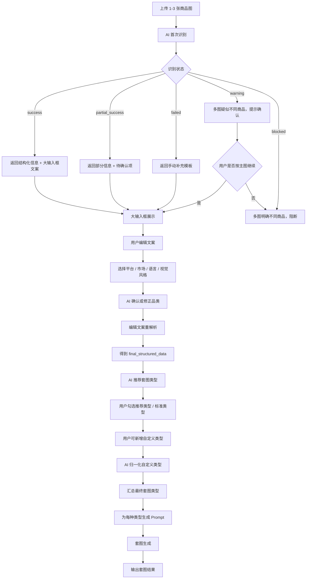

# 电商套图-完整产品方案与配置文档

> 文档目标：沉淀“电商套图”能力的完整可落地方案，供产品、研发、算法、运营配置直接使用。  
> 适用范围：商品图识别、商品信息确认、套图类型推荐、自定义套图类型、Prompt 组装、套图生成。  
> 更新时间：2026-05-01

---

## 1. 文档范围

本文档统一覆盖以下内容：

1. 产品目标与业务边界
2. 端到端流程与状态分支
3. 接口 Schema 设计
4. 平台覆盖策略
5. 全品类覆盖策略
6. 标准套图类型库
7. 各套图类型 Prompt 模板
8. 品类 Prompt Patch
9. 平台规则配置
10. 平台 × 品类优先推荐矩阵
11. 市场 / 语言 / 视觉风格规则
12. Prompt 拼接规范
13. 异常与降级策略
14. 配置表设计建议
15. 研发落地建议

---

## 2. 产品目标

电商套图用于围绕同一商品，一次性生成一组适合电商上架、投放、内容传播、详情表达的图片集合，覆盖：

- 主图
- 卖点图
- 细节图
- 参数图
- 场景图
- 氛围图
- 平台适配图
- B2B 参数说明图

系统需要解决四件事：

1. 从商品图中提取结构化商品信息
2. 把 AI 识别结果展示给用户并允许编辑
3. 基于平台、品类、市场、语言、视觉风格推荐合理的套图类型
4. 为每个套图类型生成可直接用于出图的 Prompt

---

## 3. 平台覆盖

### 3.1 覆盖平台清单

- 淘宝
- 天猫
- 京东
- 拼多多
- 1688
- 抖音电商
- 快手电商
- 小红书电商
- 亚马逊
- Temu
- TikTok Shop
- 阿里国际站
- 速卖通
- Shopee
- OZON
- SHEIN

### 3.2 平台分组

#### A. 国内综合货架电商

- 淘宝
- 天猫
- 京东
- 拼多多
- 1688

#### B. 国内内容 / 兴趣电商

- 抖音电商
- 快手电商
- 小红书电商

#### C. 跨境货架电商

- 亚马逊
- Temu
- 阿里国际站
- 速卖通
- Shopee
- OZON
- SHEIN

#### D. 跨境内容电商

- TikTok Shop

平台分组用于抽象共性规则，平台个体用于补充差异化约束。

---

## 4. 全品类覆盖

### 4.1 一级标准品类

系统内部统一使用一级标准品类，平台类目只做映射，不直接作为 Prompt 主分类输入。

1. 服饰鞋包
2. 美妆个护
3. 珠宝配饰
4. 母婴童品
5. 玩具乐器
6. 食品饮料
7. 保健营养
8. 宠物用品
9. 家居生活
10. 家纺布艺
11. 家具大件
12. 家装建材
13. 厨具餐具
14. 收纳清洁
15. 3C数码
16. 手机配件
17. 电脑办公
18. 家用电器
19. 个护小电
20. 运动户外
21. 汽车用品
22. 图书文具
23. 礼品文创
24. 工业品
25. 五金工具
26. 商用设备
27. 包装耗材
28. 原材料 / 化工
29. 农资农具
30. 医疗器械 / 健康设备
31. 成人用品
32. 虚拟 / 服务类

### 4.2 品类设计原则

- 不按平台叶子类目直接写 Prompt
- 先统一一级标准品类
- 二级品类作为扩展补充，不影响主框架
- 套图推荐必须吃品类
- Prompt 拼接必须吃品类 Patch

---

## 5. 端到端业务流程



---

## 6. 识别状态与处理逻辑

### 6.1 状态枚举

- `success`
- `partial_success`
- `failed`
- `warning`
- `blocked`

### 6.2 含义

#### `success`

- 商品主体清晰
- 品类、结构、主要特征可判断
- 可直接进入下一步

#### `partial_success`

- 可识别部分信息
- 存在较多待确认项
- 允许继续，但建议用户补充

#### `failed`

- 无法稳定识别商品主体或关键信息
- 不终止流程
- 进入“手动补充”分支

#### `warning`

- 多图疑似不是完全同一商品
- 允许按主图继续
- 其他图只做弱补充

#### `blocked`

- 多图明确不是同一商品
- 阻断自动生成
- 要求重新上传

---

## 7. 大输入框策略

### 7.1 为什么必须保留大输入框

大输入框提供连贯的用户体验，适合：

- 展示 AI 识别结果
- 让用户快速修改
- 在识别不完整时手动补充

### 7.2 正确的数据处理方式

前端展示：

- `display_text`

系统内部保留：

- `original_structured_data`
- `original_display_text`
- `user_edited_text`
- `final_structured_data`
- `user_free_text_instruction`

### 7.3 提交时规则

- 用户编辑后，不直接拿自由文本出图
- 必须在提交生成前执行一次“重解析”
- 后续所有推荐和 Prompt 生成优先使用 `final_structured_data`

---

## 8. 接口 Schema

### 8.1 商品首次识别接口

`POST /api/ecom/image-bundle/recognize`

请求：

```json
{
  "session_id": "string",
  "user_id": "string",
  "images": [
    {
      "image_id": "img_001",
      "image_url": "https://xxx.com/1.jpg",
      "is_primary": true
    }
  ],
  "biz_context": {
    "platform": "",
    "market": "",
    "language": "",
    "visual_style": ""
  }
}
```

返回：

```json
{
  "recognition_status": {
    "status": "success",
    "is_multi_image": false,
    "is_same_product": true,
    "confidence": "high",
    "issues": []
  },
  "original_structured_data": {
    "商品基础信息": {
      "product_name": "",
      "product_category_level1": "",
      "product_category_level2": "",
      "product_category_candidates": [],
      "product_color": [],
      "product_style": [],
      "product_structure": [],
      "product_material_guess": "",
      "product_details": []
    },
    "核心卖点": {
      "selling_points": []
    },
    "目标人群": {
      "target_audience": [],
      "audience_style_preference": [],
      "audience_need": []
    },
    "使用场景": {
      "usage_scenarios": [],
      "season": [],
      "lifestyle_context": []
    },
    "视觉生成标签": {
      "visual_keywords": [],
      "background_direction": [],
      "color_palette": [],
      "display_focus": [],
      "design_style": [],
      "copy_tone": []
    },
    "参数与限制项": {
      "specifications": {},
      "pending_confirmation": [],
      "forbidden_assumptions": [],
      "generation_constraints": []
    }
  },
  "display_text": "",
  "fallback_message": "",
  "edit_support": {
    "editable": true,
    "reparse_required_after_edit": true
  }
}
```

### 8.2 用户编辑后重解析接口

`POST /api/ecom/image-bundle/reparse`

请求：

```json
{
  "session_id": "string",
  "original_structured_data": {},
  "original_display_text": "",
  "user_edited_text": "",
  "biz_context": {
    "platform": "",
    "market": "",
    "language": "",
    "visual_style": ""
  }
}
```

返回：

```json
{
  "final_structured_data": {
    "商品基础信息": {},
    "核心卖点": {},
    "目标人群": {},
    "使用场景": {},
    "视觉生成标签": {},
    "参数与限制项": {}
  },
  "final_display_text": "",
  "user_free_text_instruction": "",
  "reparse_result": {
    "success": true,
    "uncertain_fields": [],
    "conflict_fields": []
  }
}
```

### 8.3 套图类型推荐接口

`POST /api/ecom/image-bundle/type-recommend`

请求：

```json
{
  "session_id": "string",
  "final_structured_data": {},
  "biz_context": {
    "platform": "amazon",
    "market": "us",
    "language": "en",
    "visual_style": "minimal_premium"
  }
}
```

返回：

```json
{
  "selection_context": {
    "platform": "amazon",
    "market": "us",
    "language": "en",
    "visual_style": "minimal_premium"
  },
  "recommended_image_types": {
    "must_have": [],
    "recommended": [],
    "optional": [],
    "not_recommended": []
  },
  "recommendation_reasoning": [],
  "prompts_by_image_type": []
}
```

### 8.4 自定义类型归一化接口

`POST /api/ecom/image-bundle/custom-type-normalize`

请求：

```json
{
  "session_id": "string",
  "final_structured_data": {},
  "biz_context": {
    "platform": "",
    "market": "",
    "language": "",
    "visual_style": ""
  },
  "custom_type_name": "",
  "custom_type_description": ""
}
```

返回：

```json
{
  "type_source": "user_defined",
  "type_key": "",
  "type_name": "",
  "type_description": "",
  "base_type_reference": "",
  "goal": "",
  "use_case": "",
  "custom_requirements": [],
  "prompt": "",
  "negative_prompt": "",
  "layout_guidance": "",
  "text_guidance": "",
  "platform_notes": "",
  "risk_flags": []
}
```

### 8.5 套图生成提交接口

`POST /api/ecom/image-bundle/generate`

请求：

```json
{
  "session_id": "string",
  "final_structured_data": {},
  "user_free_text_instruction": "",
  "biz_context": {
    "platform": "",
    "market": "",
    "language": "",
    "visual_style": ""
  },
  "selected_image_types": [
    {
      "type_key": "amazon_main",
      "type_source": "system"
    }
  ]
}
```

---

## 9. 标准套图类型库

### 9.1 基础展示类

1. `product_white_bg` 产品白底图
2. `multi_angle` 产品多角度图
3. `detail_closeup` 细节特写图
4. `detail_feature` 细节展示图
5. `specification_chart` 规格参数图
6. `packaging_display` 包装展示图
7. `parts_accessories` 配件展示图
8. `size_reference` 尺寸参考图
9. `fit_explanation` 版型说明图

### 9.2 卖点转化类

10. `core_selling_point` 核心卖点图
11. `pain_point_solution` 客户痛点图
12. `usage_comparison` 使用对比图
13. `material_craft` 材质工艺图
14. `function_explain` 功能说明图
15. `advantage_summary` 优势总结图
16. `ingredient_highlight` 成分卖点图
17. `usage_step` 使用步骤图
18. `audience_match` 适用人群图
19. `compatibility_info` 适配说明图

### 9.3 场景种草类

20. `scene_image` 场景图
21. `try_on_or_demo` 试穿试用图
22. `human_interaction` 人物互动图
23. `hero_banner` 首屏视觉图
24. `lifestyle_image` 生活方式氛围图
25. `holiday_campaign` 节日活动图
26. `styling_scene` 穿搭场景图
27. `handheld_demo` 上手使用图
28. `space_fit` 空间适配图

### 9.4 平台适配类

29. `amazon_main` 亚马逊主图
30. `amazon_sub` 亚马逊辅图
31. `short_video_cover` 内容电商封面图
32. `b2b_industrial_sheet` B2B 参数说明图

---

## 10. 标准套图类型 Prompt 模板

说明：

- `base_prompt_template`：标准正向模板
- `base_negative_prompt`：负向模板
- `default_layout_guidance`：版式建议
- `default_text_guidance`：文案排布建议

> 注意：完整 JSON 初稿建议直接使用下方第 16 节中的 `image_type_definitions` 作为入库版本。  
> 本节给出业务上可读的模板说明。

### 10.1 `product_white_bg`

正向：

```text
请为商品“{product_name}”生成一张电商产品白底图。要求商品主体完整、清晰、居中或略微偏中构图，背景为纯白或接近纯白，不添加复杂场景、无关道具和夸张装饰。必须保持商品原始颜色、结构、比例、材质观感和细节真实可信，重点突出商品轮廓、主体造型和核心外观特征。适配平台 {platform}，目标市场 {market}，目标语言 {language}，视觉风格 {visual_style}。
```

负向：

```text
不要复杂背景，不要生活场景，不要人物，不要虚构品牌标识，不要改变商品颜色，不要改变商品结构比例，不要添加不存在的细节，不要模糊，不要裁切主体，不要过度阴影，不要廉价促销感。
```

### 10.2 `multi_angle`

正向：

```text
请为商品“{product_name}”生成一张多角度展示图，通过多个视角清晰展示商品外观结构，可包含正面、侧面、背面、顶部、局部关键角度等。要求各角度之间商品比例一致、颜色一致、结构一致，画面分区清晰，便于用户快速理解商品全貌。
```

负向：

```text
不要视角混乱，不要不同角度颜色不一致，不要比例错误，不要出现互相矛盾的结构，不要复杂场景干扰。
```

### 10.3 `detail_closeup`

正向：

```text
请为商品“{product_name}”生成一张细节特写图，聚焦最能体现品质感的局部细节，重点展示 {display_focus}，如纹理、缝线、接口、材质表面、按键、边缘处理、工艺细节等。要求局部清晰、放大合理、质感突出，并与商品整体真实一致。
```

负向：

```text
不要虚构不存在的细节，不要把普通材质生成成高端材质，不要过度锐化，不要模糊。
```

### 10.4 `detail_feature`

正向：

```text
请为商品“{product_name}”生成一张细节展示图，以商品整体图配合局部细节说明的形式，突出 {display_focus}。画面应兼顾整体和局部，让用户既能看到商品全貌，也能快速理解关键细节特征。
```

### 10.5 `specification_chart`

正向：

```text
请为商品“{product_name}”生成一张规格参数图，重点表现商品尺寸、结构、部位名称、容量、规格或关键参数信息。若输入信息中没有明确数值，请预留规范的参数展示区域，不得虚构具体参数。
```

### 10.6 `packaging_display`

正向：

```text
请为商品“{product_name}”生成一张包装展示图，展示商品本体与包装、外盒、袋装或附件的组合关系，突出完整度与交付感。若原始输入未明确包装样式，请以通用包装展示逻辑表达，不得虚构具体品牌包装设计。
```

### 10.7 `parts_accessories`

正向：

```text
请为商品“{product_name}”生成一张配件展示图，清晰展示商品主件与配件、附属部件、连接件或使用附件的对应关系。要求结构清楚，配件归属明确。
```

### 10.8 `size_reference`

正向：

```text
请为商品“{product_name}”生成一张尺寸参考图，重点说明商品尺寸、穿着或摆放比例、人与物或物与空间之间的大小关系。若缺少准确数值，请以比例感展示为主，不得编造精确尺寸。
```

### 10.9 `fit_explanation`

正向：

```text
请为商品“{product_name}”生成一张版型说明图，重点表现商品廓形、版型结构、肩线、袖型、腰线、下摆、长度感或贴合程度，帮助用户理解商品轮廓特征。
```

### 10.10 `core_selling_point`

正向：

```text
请基于商品“{product_name}”的核心卖点 {selling_points} 生成一张卖点图。画面围绕最重要的1个卖点展开，突出商品优势，并通过构图、光线、局部细节或场景强化该卖点对应的视觉感受。
```

### 10.11 `pain_point_solution`

正向：

```text
请为商品“{product_name}”生成一张客户痛点图，围绕目标用户在选购或使用同类商品时的常见问题展开，并突出该商品的解决价值。画面应具备明确的问题与解决结构。
```

### 10.12 `usage_comparison`

正向：

```text
请为商品“{product_name}”生成一张使用对比图，通过左右或上下结构直观体现商品的使用价值、体验差异或有无使用时的对比效果。画面必须逻辑清晰、对比自然。
```

### 10.13 `material_craft`

正向：

```text
请为商品“{product_name}”生成一张材质工艺图，重点突出商品的材质纹理、织法、表面触感、工艺细节、边缘处理或拼接方式，强调品质感和细节完成度。
```

### 10.14 `function_explain`

正向：

```text
请为商品“{product_name}”生成一张功能说明图，系统化展示商品的核心功能、使用方式或结构作用。画面应清晰说明功能点与商品结构之间的对应关系。
```

### 10.15 `advantage_summary`

正向：

```text
请为商品“{product_name}”生成一张优势总结图，系统梳理3到5个主要优势，帮助用户快速建立购买认知。整体需要整洁、信息层级分明。
```

### 10.16 `ingredient_highlight`

正向：

```text
请为商品“{product_name}”生成一张成分卖点图，重点展示可确认的成分、原料、配料或材质来源信息，并将其与商品卖点做合理关联。仅可使用已确认或高可信输入，不得虚构成分。
```

### 10.17 `usage_step`

正向：

```text
请为商品“{product_name}”生成一张使用步骤图，以分步骤方式展示商品的使用流程、操作顺序或穿戴步骤。画面需要结构清晰、步骤明确、便于快速理解。
```

### 10.18 `audience_match`

正向：

```text
请为商品“{product_name}”生成一张适用人群图，围绕目标人群 {target_audience} 与需求 {audience_need}，表达商品适合谁、为什么适合。画面应自然、清晰。
```

### 10.19 `compatibility_info`

正向：

```text
请为商品“{product_name}”生成一张适配说明图，重点表达商品适配的设备、场景、空间、对象或搭配组合。要求兼容关系明确，不得虚构适配范围。
```

### 10.20 `scene_image`

正向：

```text
请为商品“{product_name}”生成一张场景图，将商品自然融入 {usage_scenarios} 对应的真实环境中，氛围符合 {lifestyle_context}。场景应服务于商品展示，而不是喧宾夺主。
```

### 10.21 `try_on_or_demo`

正向：

```text
请为商品“{product_name}”生成一张试穿或试用图，通过人物上身、上手或实际使用状态，直观体现商品效果、比例、互动方式和使用感。人物与商品关系要自然，商品仍是核心主体。
```

### 10.22 `human_interaction`

正向：

```text
请为商品“{product_name}”生成一张人物互动图，通过人物与商品的自然互动增强代入感和信任感。人物气质需符合 {target_audience} 与 {market} 审美偏好，整体调性符合 {visual_style}。
```

### 10.23 `hero_banner`

正向：

```text
请为商品“{product_name}”生成一张首屏视觉图，用于首页首屏、活动页头图或详情页第一屏。画面需要兼顾商品展示、品牌感、氛围表达与转化导向，同时预留标题、副标题和按钮区域。
```

### 10.24 `lifestyle_image`

正向：

```text
请为商品“{product_name}”生成一张生活方式氛围图，围绕 {visual_keywords} 和 {lifestyle_context} 塑造情绪、季节感与生活方式质感。画面需要自然、有情绪、有商品存在感。
```

### 10.25 `holiday_campaign`

正向：

```text
请为商品“{product_name}”生成一张节日活动图，结合 {market} 市场的节日氛围与 {visual_style} 风格，强化活动感、购买动机和礼赠或上新氛围，同时保持商品主体清晰可见。
```

### 10.26 `styling_scene`

正向：

```text
请为商品“{product_name}”生成一张穿搭场景图，将商品置于符合目标人群与风格偏好的穿搭环境中，重点体现搭配关系、整体气质和场景代入感。
```

### 10.27 `handheld_demo`

正向：

```text
请为商品“{product_name}”生成一张上手使用图，直观展示商品被手持、操作、接触或使用时的状态，强调尺寸感、交互感和真实体验。
```

### 10.28 `space_fit`

正向：

```text
请为商品“{product_name}”生成一张空间适配图，展示商品与目标空间之间的尺寸关系、摆放关系和风格匹配度，适合表达居家、办公、收纳、家具等商品的适配性。
```

### 10.29 `amazon_main`

正向：

```text
请为商品“{product_name}”生成一张符合亚马逊主图风格的商品图片。要求纯白背景，商品主体占画面主要区域，完整、清晰、边缘干净，不添加文字、人物、场景和无关道具。必须保持商品原始颜色、结构和材质观感。
```

### 10.30 `amazon_sub`

正向：

```text
请为商品“{product_name}”生成一张适合亚马逊辅图的展示图，可用于说明卖点、细节、参数或使用方式。画面需要结构清晰、信息可读，同时保持商品主体与卖点表达的平衡。
```

### 10.31 `short_video_cover`

正向：

```text
请为商品“{product_name}”生成一张适合内容电商、短视频商品卡或封面图的视觉图片。要求第一眼吸引力强，商品主体清楚，卖点直观，氛围或人物表达符合 {platform} 与 {market} 内容消费习惯。
```

### 10.32 `b2b_industrial_sheet`

正向：

```text
请为商品“{product_name}”生成一张适合B2B、工业品、批发商品详情使用的参数说明图。重点展示规格、结构、工艺、应用场景、包装或供货信息，整体风格专业、清晰、可信，便于采购和询盘决策。
```

---

## 11. 全品类 Prompt Patch 规则

### 11.1 服饰鞋包

补丁：

```text
重点突出版型、轮廓、面料纹理、穿搭效果与上身氛围。若涉及人物展示，应确保穿着逻辑自然，版型真实，不得擅自改成更修身、更显瘦或更挺括的效果。若无明确尺码信息，不要虚构具体尺码建议。
```

风险：

```text
不要虚构显瘦、增高、塑形等绝对效果，不要改变衣长袖长比例，不要把普通面料生成成羊绒、真丝、真皮等未确认材质。
```

### 11.2 美妆个护

补丁：

```text
重点突出产品包装识别度、质地表现、使用步骤和成分卖点，整体风格需干净、可信、专业。若涉及人物皮肤、发质、妆效展示，只能做合理视觉表达，不得暗示医疗治疗或保证性功效。
```

风险：

```text
不要使用祛痘、治疗、修复、逆龄、永久、美白立竿见影等高风险绝对化表达，不要虚构医生背书、实验数据或功效结果。
```

### 11.3 珠宝配饰

补丁：

```text
重点突出光泽、切面、金属质感、佩戴比例与精致细节，整体风格需高级、克制、精致。若未确认材质，不得直接写足金、纯银、钻石、珍珠等级等。
```

### 11.4 母婴童品

补丁：

```text
重点表达安心感、使用便捷性、适龄适用逻辑和亲子生活场景，画面风格需温和、干净、可信。若无明确认证信息，不得写食品级、医用级、0添加、绝对安全等结论。
```

### 11.5 食品饮料

补丁：

```text
重点表达食材感、口感氛围、包装规格和消费场景，整体要干净、诱人但不过度夸张。若无明确配料和营养信息，不得编造成分表、热量表或健康功效。
```

### 11.6 保健营养

补丁：

```text
重点突出规格、食用方式、成分逻辑和适用人群，但必须避免任何治疗化、医疗化、处方式表达。整体视觉可专业可信，但不可夸大效果。
```

### 11.7 家居生活 / 家纺 / 家具

补丁：

```text
重点突出空间适配关系、居家氛围、材质感和使用便利性。若是家具大件，必须保证空间透视合理、比例真实、商品结构不变形。
```

### 11.8 3C 数码 / 家电

补丁：

```text
重点突出结构、接口、功能点、使用场景和参数逻辑，整体风格应偏理性、科技、清晰。若无确认信息，不得虚构芯片、续航、分辨率、功率、快充、杀菌率等参数。
```

### 11.9 工业品 / 五金 / 商用设备 / 包装耗材

补丁：

```text
重点突出规格、结构、工艺、应用场景、接口尺寸逻辑和采购决策所需信息。整体风格应专业、可靠、工程化，适合 B2B 理性阅读。
```

### 11.10 医疗器械 / 健康设备

补丁：

```text
重点突出设备外观、使用流程、结构说明和参数信息，整体风格专业克制。除非有明确授权信息，不得出现治疗、治愈、诊断保证等表达。
```

### 11.11 成人用品

补丁：

```text
重点表达产品结构、材质、安全感和包装逻辑，整体风格需克制、合规、避免低俗化。需严格遵守平台内容规范。
```

### 11.12 虚拟 / 服务类

补丁：

```text
当前类目更适合信息型视觉图、服务说明图或权益展示图，不适合按实体商品逻辑生成白底图、细节图和场景图。
```

---

## 12. 平台规则

### 12.1 平台规则作用

平台规则用于回答三个问题：

1. 该平台允许什么类型
2. 该平台优先什么类型
3. 该平台有哪些画面约束

### 12.2 平台规则建议

> 完整 JSON 初稿建议直接使用第 17 节中的 `platform_type_rules` 入库版本。

核心平台特征摘要：

- 淘宝：卖点图强、信息密度中高、可适度转化
- 天猫：强调品牌感和高级感，避免低价促销视觉
- 京东：参数图、功能图、说明图优先
- 拼多多：利益点直给、对比图强、强转化
- 1688：B2B 参数图、规格图、包装图优先
- 抖音：封面图、试用图、场景图优先
- 快手：直给型卖点图、封面图、对比图优先
- 小红书：生活方式图、种草封面图、穿搭图优先
- 亚马逊：主图和辅图规范极强
- Temu：白底图 + 卖点图 + 对比图
- TikTok Shop：封面图、试穿试用图、场景图
- 阿里国际站：工业参数图、供货说明图
- 速卖通：白底图、卖点图、参数图、场景图
- Shopee：白底图、卖点图、活动图
- OZON：清晰货架图 + 参数图
- SHEIN：穿搭图、试穿图、面料质感图

---

## 13. 平台 × 品类推荐矩阵

### 13.1 推荐原则

推荐引擎不建议手工穷举所有笛卡尔积，而是按：

`标准类型库`
→ `平台允许与禁用`
→ `品类适用与禁用`
→ `平台 × 品类优先级`
→ `平台 / 市场 / 语言 / 卖点 / 风格补充排序`

### 13.2 典型推荐

#### 亚马逊 + 服饰鞋包

- `must_have`
  - `amazon_main`
  - `multi_angle`
  - `detail_closeup`
  - `fit_explanation`
  - `size_reference`

#### 抖音 + 美妆个护

- `must_have`
  - `short_video_cover`
  - `usage_step`
  - `scene_image`
  - `ingredient_highlight`
  - `human_interaction`

#### 1688 + 工业品

- `must_have`
  - `b2b_industrial_sheet`
  - `specification_chart`
  - `compatibility_info`
  - `packaging_display`
  - `detail_feature`

#### 小红书 + 女装

- `must_have`
  - `lifestyle_image`
  - `styling_scene`
  - `try_on_or_demo`
  - `detail_closeup`
  - `hero_banner`

> 完整推荐矩阵初稿建议直接使用第 18 节中的 `platform_category_priorities`。

---

## 14. 平台 / 市场 / 语言 / 卖点 / 视觉风格规则

这一层规则不决定“能不能用某套图类型”，而决定：

- 平台语境
- 排版节奏
- 配色偏好
- 卖点表达方式
- 视觉密度
- 标题字数
- 情绪方向

### 14.1 `market_visual_rules` 初稿

```json
{
  "independent_fields": {
    "platform": {
      "label": "平台",
      "prompts": {
        "taobao": "适配淘宝商品图与详情语境，强调卖点直给、信息读取高效和首屏转化效率。",
        "amazon": "适配亚马逊商品图与辅图语境，强调结构清晰、信息可信、卖点与参数真实。",
        "xiaohongshu": "适配小红书内容种草语境，强调生活方式氛围、审美感和真实分享感。"
      }
    },
    "market": {
      "label": "市场",
      "prompts": {
        "cn": "符合大陆市场审美，信息传达直接高效，画面节奏紧凑但不杂乱。",
        "us": "符合北美市场偏好，强调简洁层级、真实质感、留白和理性价值表达。",
        "sea": "符合东南亚市场偏好，强调高效转化、亮眼配色和重点直给。"
      }
    },
    "language": {
      "label": "语言",
      "prompts": {
        "zh-CN": "使用简体中文表达，标题和说明应直接、自然易懂，适合电商快速阅读。",
        "en": "使用简洁自然的英文标题与说明，避免中式英文，控制句长，强调清晰和专业。",
        "ja": "使用自然简洁的日语表达，强调礼貌克制、信息清楚和结构有序。"
      }
    },
    "selling_point": {
      "label": "卖点",
      "prompts": {
        "conversion_first": "卖点表达以转化效率优先，主标题先讲利益点，再补充佐证信息。",
        "feature_driven": "卖点表达以功能特征优先，突出结构、参数、材质、机制或使用价值。",
        "scenario_value": "卖点表达要与使用场景绑定，通过场景化关系说明商品为什么有价值。"
      }
    },
    "visual_style": {
      "label": "视觉风格",
      "prompts": {
        "conversion_direct": "整体视觉偏高对比、重点明确、信息直给，适合强转化型商品图。",
        "warm_lifestyle": "整体视觉温暖自然、轻松有生活感，画面更注重场景氛围和真实代入感。",
        "minimal_premium": "整体视觉简洁克制、留白适度、质感优先，强调高级感和秩序感。"
      }
    }
  },
  "combination_rules": [
    {
      "rule_key": "amazon_us_minimal_premium",
      "conditions": {
        "platform": "amazon",
        "market": "us",
        "visual_style": "minimal_premium"
      },
      "prompt": "进一步加强留白、真实质感和参数可信度，避免夸张导购海报感。",
      "bias_image_types": ["product_white_bg", "detail_closeup", "hero_banner"]
    }
  ]
}
```

### 14.2 使用方式

若平台和品类已经决定套图类型，平台 / 市场 / 语言 / 卖点 / 视觉风格只负责补充：

- 平台内容语境
- 画面语气
- 颜色倾向
- 卖点组织方式
- 标题长度
- 留白密度
- 文字多少

主流程建议：

1. 按前端独立选择值分别读取 `platform`、`market`、`language`、`selling_point`、`visual_style` 五组 `prompt`
2. 依次拼接为值级 patch
3. 再判断是否命中 `combination_rules`
4. 命中时仅追加增强 prompt 和轻量 `bias_image_types`，不替代独立字段配置

---

## 15. 自定义套图类型

### 15.1 用户输入

- `custom_type_name`
- `custom_type_description`

### 15.2 归一化原则

用户自定义类型不能直接原样出图，而应：

1. 映射到最接近的基础类型
2. 保留用户特殊要求
3. 检测平台、品类、商品事实冲突
4. 生成最终 Prompt

### 15.3 风险标签

- `conflict_with_product`
- `conflict_with_platform`
- `insufficient_information`
- `style_overreach`
- `text_dependency`

### 15.4 示例

用户输入：

- 名称：`圣诞礼物首页大图`
- 说明：`突出欧美节日感和送礼氛围，适合首页活动位`

归一化输出：

- `base_type_reference = hero_banner`
- `custom_requirements = ["节日氛围", "送礼感", "首页横幅", "欧美审美"]`
- `risk_flags = []`

---

## 16. 配置表一：`image_type_definitions`

> 入库时建议直接以 JSON 保存，以下内容为推荐初稿。  
> 为避免文档重复，这里保留精简版字段说明，完整初稿可直接参考此前整理的 32 个类型定义结构。

推荐字段：

```json
{
  "type_key": "",
  "type_name": "",
  "category": "",
  "type_description": "",
  "base_prompt_template": "",
  "base_negative_prompt": "",
  "default_layout_guidance": "",
  "default_text_guidance": ""
}
```

字段说明：

- `type_key`
  - 类型唯一标识
  - 研发和配置层面的主键
  - 推荐使用英文 snake_case
  - 示例：`product_white_bg`

- `type_name`
  - 用户可见的套图类型名称
  - 用于前端卡片、弹窗、模板名称展示
  - 示例：`产品白底图`

- `category`
  - 套图类型所属的大类
  - 用于前端分组和后台筛选
  - 推荐值：`基础展示类`、`卖点转化类`、`场景种草类`、`平台适配类`

- `type_description`
  - 对该类型用途的简短解释
  - 用于前端 tooltip、卡片副标题、推荐理由辅助
  - 示例：`纯白背景展示商品主体`

- `base_prompt_template`
  - 该类型的基础正向 Prompt 模板
  - 是后续拼接最终 Prompt 的第一层
  - 允许包含变量占位符，如 `{product_name}`、`{platform}`

- `base_negative_prompt`
  - 该类型的基础负向 Prompt 模板
  - 约束这类图不应出现什么内容
  - 后续会叠加品类风险和平台约束

- `default_layout_guidance`
  - 默认版式建议
  - 给版式模型、模板引擎或前端预览使用
  - 示例：`主体居中，留白充足，适合标准主图裁切`

- `default_text_guidance`
  - 默认文案排布建议
  - 用于说明这一类图适合怎样的文字结构
  - 示例：`默认无文案，可预留极少量角标位`

建议直接落库的类型清单：

- `product_white_bg`
- `multi_angle`
- `detail_closeup`
- `detail_feature`
- `specification_chart`
- `packaging_display`
- `parts_accessories`
- `size_reference`
- `fit_explanation`
- `core_selling_point`
- `pain_point_solution`
- `usage_comparison`
- `material_craft`
- `function_explain`
- `advantage_summary`
- `ingredient_highlight`
- `usage_step`
- `audience_match`
- `compatibility_info`
- `scene_image`
- `try_on_or_demo`
- `human_interaction`
- `hero_banner`
- `lifestyle_image`
- `holiday_campaign`
- `styling_scene`
- `handheld_demo`
- `space_fit`
- `amazon_main`
- `amazon_sub`
- `short_video_cover`
- `b2b_industrial_sheet`

---

## 17. 配置表二：`platform_type_rules`

推荐字段：

```json
{
  "platform": "",
  "type_key": "",
  "is_allowed": true,
  "priority": 0,
  "platform_notes": "",
  "platform_constraints": []
}
```

字段说明：

- `platform`
  - 平台标识
  - 与用户选择的平台值保持一致
  - 示例：`amazon`、`taobao`、`xiaohongshu`

- `type_key`
  - 关联的套图类型标识
  - 与 `image_type_definitions.type_key` 对应
  - 表示“这个平台如何看待这个图型”

- `is_allowed`
  - 该平台是否允许使用该套图类型
  - `true` 表示可参与推荐
  - `false` 表示应直接进入 `not_recommended` 或阻断

- `priority`
  - 平台对该套图类型的基础优先级分数
  - 数值越高，推荐排序越靠前
  - 建议范围 `0-100`
  - 这是推荐引擎的基础打分来源之一

- `platform_notes`
  - 面向业务和前端的说明文案
  - 用于解释为什么这个平台适合或不适合该类型
  - 示例：`Amazon主图核心必备`

- `platform_constraints`
  - 平台级的硬约束或软约束数组
  - 可用于 Negative Prompt、前端提示、风险校验
  - 示例：`["纯白背景", "无人物", "无文案", "无场景"]`

平台规则设计原则：

- 用于“是否允许”和“优先级”过滤
- 不承载品类逻辑
- 不承载用户自定义逻辑
- 平台限制优先级高于市场偏好

关键示例：

- Amazon 主图：
  - 允许 `amazon_main`
  - 禁止节日场景型主图
  - 约束：纯白、无文案、无人物、无场景

- 小红书：
  - 强推荐 `lifestyle_image` / `styling_scene`
  - 不推荐 `amazon_main`

- 1688：
  - 强推荐 `b2b_industrial_sheet`
  - 弱化 `lifestyle_image`

> 实际入库建议直接使用已整理的全平台初稿。

---

## 18. 配置表三：`platform_category_priorities`

推荐字段：

```json
{
  "platform": "",
  "category_key": "",
  "priority": 0,
  "preferred_image_types": []
}
```

字段说明：

- `platform`
  - 平台标识
  - 与平台选择值保持一致

- `category_key`
  - 品类标识
  - 与 `category_strategy_rules.category_key` 对应
  - 表示“在这个平台里，这个品类更偏好哪些图型”

- `priority`
  - 该平台下该品类的整体优先级权重
  - 建议范围 `0-100`
  - 用于对同一平台下不同品类做差异化推荐排序

- `preferred_image_types`
  - 该平台下该品类优先推荐的图型列表
  - 与 `image_type_definitions.type_key` 对应
  - 推荐引擎会对这些类型额外加分

作用：

- 给平台 × 品类推荐提供显式加权
- 不替代平台规则和品类规则
- 决定“must_have / recommended / optional”排序

示例：

```json
{
  "platform": "xiaohongshu",
  "category_key": "fashion_apparel",
  "priority": 100,
  "preferred_image_types": ["lifestyle_image", "styling_scene", "try_on_or_demo", "detail_closeup", "hero_banner"]
}
```

---

## 19. 配置表四：`category_strategy_rules`

推荐字段：

```json
{
  "category_key": "",
  "category_name": "",
  "applicable_image_types": [],
  "recommended_image_types": [],
  "forbidden_image_types": [],
  "extra_image_types": [],
  "display_focus_rules": [],
  "prompt_patch_rules": [],
  "risk_rules": []
}
```

作用：

- 定义品类可用图型
- 定义品类推荐图型
- 定义品类禁用图型
- 定义品类 Prompt Patch
- 定义品类敏感风险

字段说明：

- `category_key`
  - 品类唯一标识
  - 作为系统内部品类主键
  - 示例：`fashion_apparel`、`consumer_electronics`

- `category_name`
  - 品类中文名
  - 用于前端展示、后台筛选、日志查看
  - 示例：`服饰鞋包`

- `applicable_image_types`
  - 该品类理论上可用的套图类型列表
  - 推荐引擎会用它做第一层品类过滤
  - 如果某类型不在此列表内，通常不参与推荐

- `recommended_image_types`
  - 该品类优先推荐的套图类型列表
  - 用于推荐加分
  - 一般是这个品类的高频高价值图型

- `forbidden_image_types`
  - 该品类不适用的套图类型列表
  - 命中后应直接剔除或归入 `not_recommended`
  - 示例：工业品通常禁用 `lifestyle_image`

- `extra_image_types`
  - 该品类的扩展专属图型列表
  - 用于补充标准类型库
  - 示例：服饰额外强调 `fit_explanation`

- `display_focus_rules`
  - 该品类在出图时应重点展示的部位、结构、质感或信息点
  - 用于生成 Prompt 时补强“重点展示什么”
  - 示例：服饰强调 `面料纹理`、`版型廓形`

- `prompt_patch_rules`
  - 该品类的 Prompt 补丁规则
  - 用于拼接到基础类型 Prompt 后
  - 负责表达“这类商品的画面应该怎么强调”

- `risk_rules`
  - 该品类的风险限制规则
  - 可用于 Negative Prompt、合规检查和推荐降权
  - 示例：美妆不能夸大疗效，食品不能虚构营养数值

---

## 19.1 配置表五：`market_visual_rules`

推荐字段：

```json
{
  "independent_fields": {
    "platform": {
      "label": "",
      "prompts": {}
    },
    "market": {
      "label": "",
      "prompts": {}
    },
    "language": {
      "label": "",
      "prompts": {}
    },
    "selling_point": {
      "label": "",
      "prompts": {}
    },
    "visual_style": {
      "label": "",
      "prompts": {}
    }
  },
  "combination_rules": []
}
```

字段说明：

- `independent_fields.platform`
  - 平台独立配置
  - 由前端平台字段单独选择并直接读取对应 prompt
  - 示例值：`taobao`、`amazon`、`xiaohongshu`

- `independent_fields.market`
  - 市场独立配置
  - 用于区分审美偏好、信息节奏和区域化表达
  - 示例值：`cn`、`us`、`eu`、`jp`、`sea`

- `independent_fields.language`
  - 语言独立配置
  - 用于控制文案长度、句式风格、阅读方向和版式留白
  - 示例值：`zh-CN`、`en`、`ja`、`ko`、`ar`

- `independent_fields.selling_point`
  - 卖点独立配置
  - 用于控制卖点偏利益点、功能点、场景价值或情绪表达
  - 示例值：`conversion_first`、`feature_driven`、`scenario_value`

- `independent_fields.visual_style`
  - 视觉风格独立配置
  - 与用户选择的视觉风格值一致
  - 示例值：`minimal_premium`、`warm_lifestyle`、`conversion_direct`

- `combination_rules`
  - 组合增强规则
  - 仅在命中特定平台 / 市场 / 语言 / 卖点 / 风格组合时追加增强 prompt
  - 可附带轻量 `bias_image_types`
  - 不承担独立字段值映射职责

---

## 20. Prompt 拼接规范

最终单张图 Prompt 不建议完全由模型自由生成，建议采用配置驱动拼接：

### 20.1 拼接公式

```text
最终 Prompt =
[基础类型 Prompt]
+ [品类 Patch]
+ [平台类型 Patch]
+ [平台 / 市场 / 语言 / 卖点 / 风格值级 Patch]
+ [组合增强 Patch（命中时）]
+ [用户补充要求]
```

### 20.2 拼接顺序说明

#### 1. 基础类型 Prompt

决定这张图本质是什么图。

#### 2. 品类 Patch

决定图里重点突出什么，哪些东西不能乱写。

#### 3. 平台 Patch

决定是否合规，是否适合平台表达。

#### 4. 平台 / 市场 / 语言 / 卖点 / 风格 Patch

按前端独立字段分别取 prompt，决定平台语境、视觉调性、卖点组织方式、配色和文案密度。

#### 5. 组合增强 Patch

只在命中特定组合规则时追加，用于微调偏好，不替代独立字段配置。

#### 6. 用户补充要求

最后叠加用户偏好，但不能覆盖平台和商品事实。

### 20.3 负向 Prompt 拼接

```text
最终 Negative Prompt =
[基础类型 negative_prompt]
+ [品类风险 negative]
+ [平台禁用项]
+ [自定义风险项]
```

---

## 21. 推荐引擎逻辑

### 21.1 推荐输入

- `final_structured_data`
- `platform`
- `market`
- `language`
- `visual_style`
- `category_key`

### 21.2 推荐流程

1. 从 `image_type_definitions` 读取全量候选类型
2. 用 `platform_type_rules` 过滤 `is_allowed = true`
3. 用 `category_strategy_rules`
   - 保留 `applicable_image_types`
   - 剔除 `forbidden_image_types`
4. 用 `platform_category_priorities` 给候选类型加权
5. 结合 `market_visual_rules` 做风格偏好排序
6. 输出：
   - `must_have`
   - `recommended`
   - `optional`
   - `not_recommended`

### 21.3 推荐分档建议

- `score >= 95` → `must_have`
- `80 <= score < 95` → `recommended`
- `60 <= score < 80` → `optional`
- `< 60` 或命中禁用 → `not_recommended`

---

## 22. 异常与降级策略

### 22.1 商品识别失败

处理：

- 不阻断
- 给手动补充模板
- 后续以用户编辑为主

### 22.2 多图 `warning`

处理：

- 允许按主图继续
- 其他图只做弱补充

### 22.3 多图 `blocked`

处理：

- 阻断自动生成
- 提示重新上传同款图

### 22.4 重解析失败

处理：

- 使用 `original_structured_data`
- 将 `user_edited_text` 挂到 `user_free_text_instruction`
- 在最终 Prompt 末尾追加：

```text
请同时参考用户补充要求：{user_free_text_instruction}
```

### 22.5 自定义类型高风险

若命中：

- `conflict_with_platform`
- `conflict_with_product`

处理：

- 前端提示修改
- 默认不建议直接放行

---

## 23. 首轮识别 Prompt

```text
请基于用户上传的商品图片，执行“电商套图生成前置识别”任务，并输出标准 JSON 结果。

任务目标：
1. 输出商品识别状态
2. 输出结构化商品信息
3. 输出适合展示在大输入框中的连续文案
4. 输出异常提示信息
5. 输出一级和二级品类判断及候选品类

识别原则：
1. 只能根据图片中可见信息进行识别，不得臆造品牌、价格、成分、尺码、克重、功能科技、产地、洗护方式等信息。
2. 不确定的信息请标注“待确认”或“疑似”。
3. 若为多张图片，请先判断是否为同一商品。
4. 若多图明确不是同一商品，输出 blocked 状态，不要强行合并。
5. 输出必须为合法 JSON，不要输出 Markdown，不要输出解释性文字。

请严格按预设 schema 输出。
```

---

## 24. 编辑后重解析 Prompt

```text
请将用户编辑后的商品描述文本，重新整理为标准结构化商品信息，用于电商套图生成。

要求：
1. 优先保留用户明确修改过的信息。
2. 若用户新增了风格、场景、人群、卖点等内容，请归入对应字段。
3. 若存在无法结构化但对生成有帮助的偏好信息，请保留到 user_free_text_instruction。
4. 不得臆造品牌、价格、尺寸、成分、功能科技等信息。
5. 输出必须为合法 JSON。
6. 必须补充最终品类判断，若不确定则给出候选品类。

请按预设 schema 输出。
```

---

## 25. 套图类型推荐 Prompt

```text
请根据以下输入，为当前商品推荐适合的电商套图类型，并为每个推荐类型生成专属出图提示词。

输入包括：
1. final_structured_data
2. 电商平台
3. 目标市场
4. 目标语言
5. 视觉风格
6. 标准套图类型库
7. 平台适配规则
8. 市场视觉偏好规则
9. 品类策略规则

要求：
1. 仅从标准套图类型库和品类扩展类型中筛选，不要凭空发明新类型。
2. 输出 must_have、recommended、optional、not_recommended 四类结果。
3. 每个推荐类型都需要输出：
- type_key
- type_name
- recommendation_reason
- goal
- prompt
- negative_prompt
- layout_guidance
- text_guidance
- platform_notes
- risk_flags
4. 推荐时必须综合考虑平台、品类、市场、语言、风格。
5. 若某类型被平台允许但不适合该品类，应归入 not_recommended 或 forbidden。

输出必须为标准 JSON。
```

---

## 26. 自定义类型归一化 Prompt

```text
请根据用户自定义的套图类型名称与说明，将其归一化为可执行的电商套图类型，并生成可落地的专属出图提示词。

输入包括：
1. final_structured_data
2. 电商平台
3. 目标市场
4. 目标语言
5. 视觉风格
6. category_key
7. custom_type_name
8. custom_type_description
9. 标准套图类型库
10. 自定义类型映射规则
11. 平台适配规则
12. 品类策略规则

要求：
1. 将用户自定义类型映射到最接近的标准基础类型 base_type_reference。
2. 保留用户特殊要求到 custom_requirements。
3. 若需求与商品事实、平台规范、品类特征冲突，请写入 risk_flags。
4. 输出 prompt、negative_prompt、layout_guidance、text_guidance、platform_notes。
5. 输出必须为标准 JSON。
```

---

## 27. 研发落地建议

### P0

- 商品首次识别
- 大输入框展示
- 编辑重解析
- 平台 / 市场 / 语言 / 卖点 / 风格
- 一级品类确认
- 标准套图类型库
- 平台规则
- 品类规则
- 套图类型推荐

### P1

- 自定义类型归一化
- 多图 warning / blocked
- 市场视觉规则
- Prompt 模板配置化

### P2

- 二级品类细化
- 重点平台专项优化
- 推荐策略 AB Test
- 多语言版式细化

---

## 28. 最终结论

电商套图不应作为“一个通用大模型自由生成”的单点能力，而应拆成：

1. 商品识别
2. 文案确认
3. 品类确认
4. 套图类型推荐
5. 自定义类型归一化
6. 配置驱动 Prompt 拼接
7. 套图生成

最终落地架构应为：

`标准类型库 + 平台规则 + 品类策略 + 市场语言风格规则 + 用户自定义归一化 + Prompt 动态拼接`

这套结构既能覆盖全平台、全品类，也能在后续通过配置和实验持续优化。
