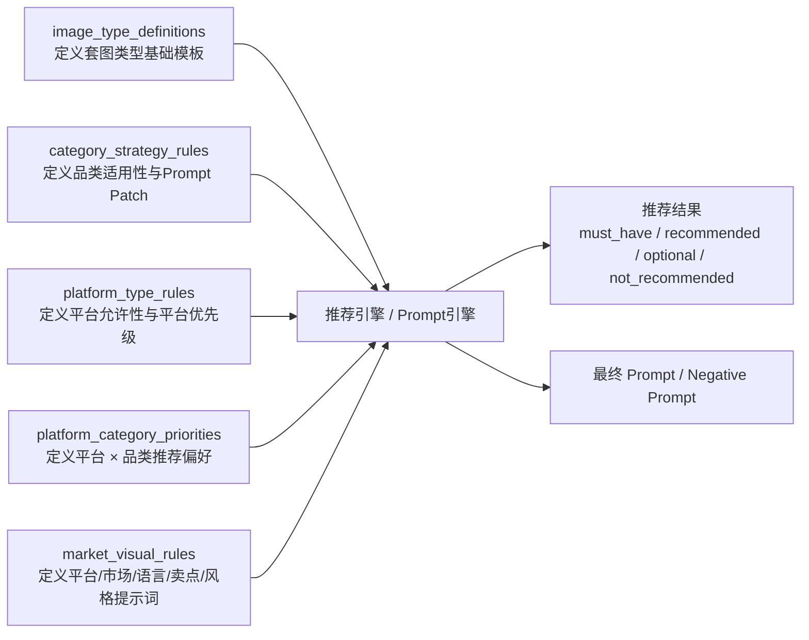
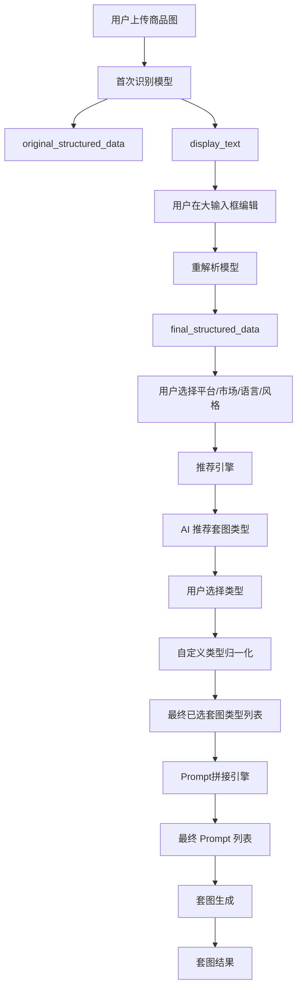
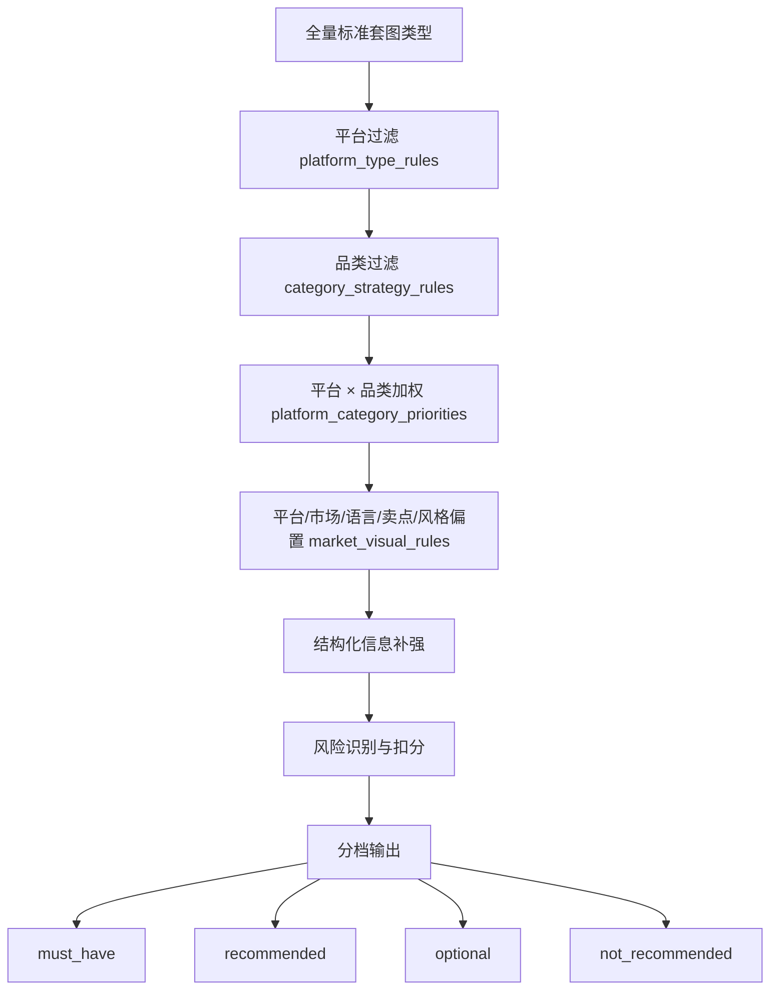
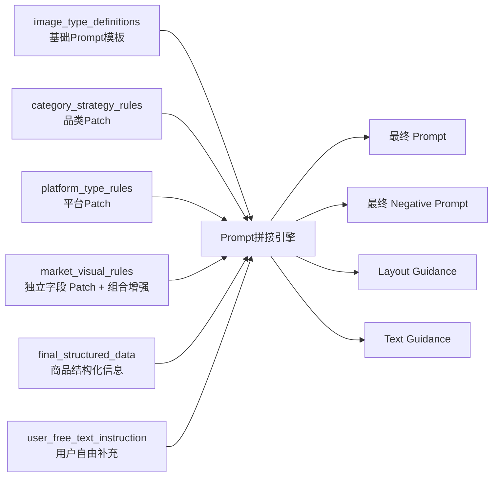
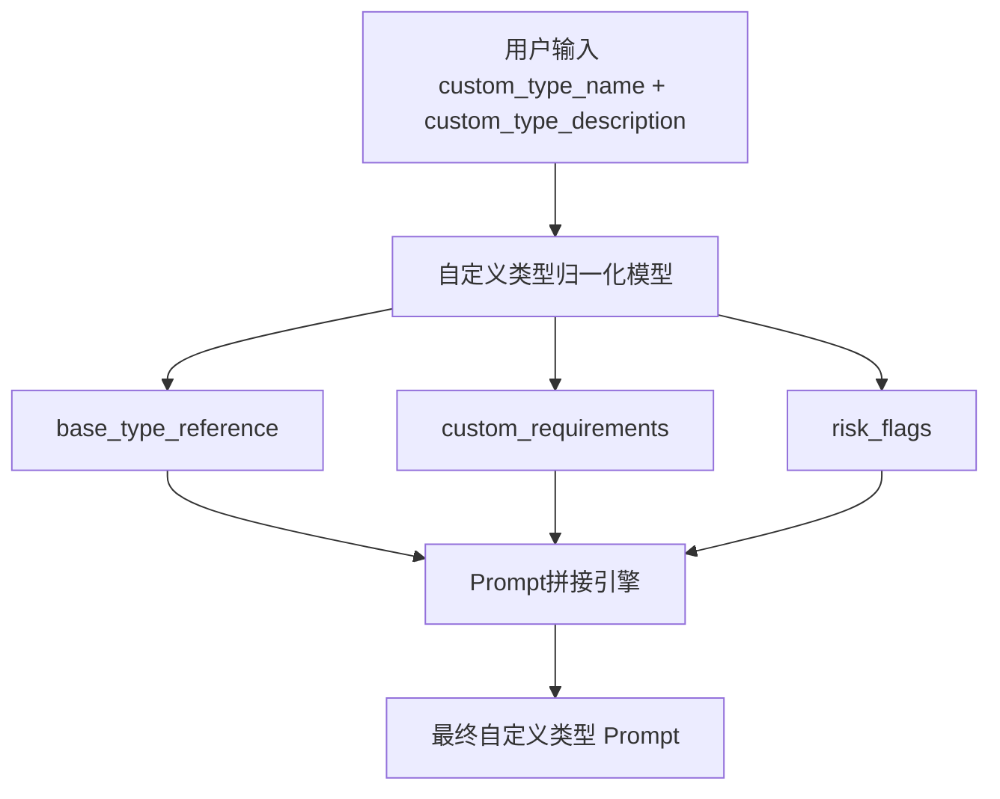
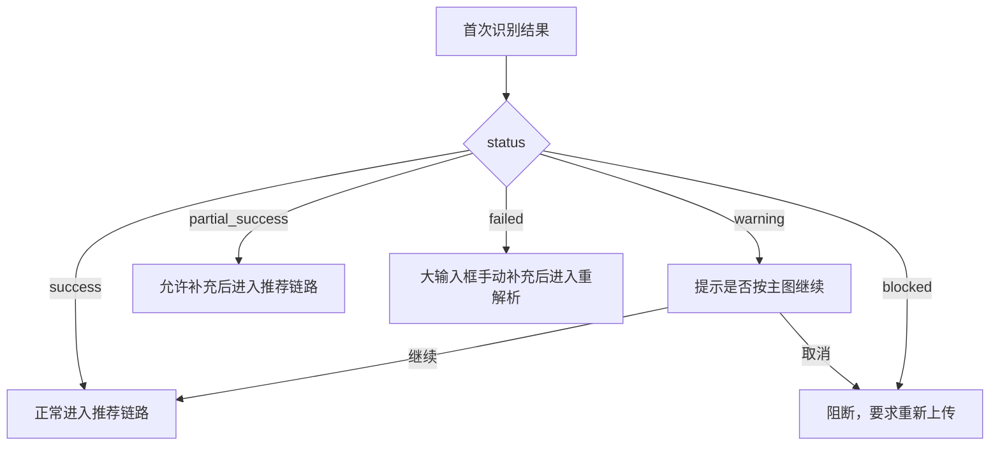

# 电商套图-配置表关系图与数据流转图

> 用途：给产品、研发、算法、配置、测试在评审和联调时快速理解“电商套图”功能的配置关系和数据流向。  
> 更新时间：2026-05-06

---

## 1. 文档目标

本文档重点回答 4 个问题：

1. 5 张配置表之间是什么关系
2. 用户一次生成套图时，数据如何在系统里流转
3. 推荐引擎在什么时候读取哪张表
4. Prompt 最终是如何被拼出来的

---

## 2. 核心对象

系统内有 3 类核心对象：

### 2.1 用户输入对象

- 商品图
- 大输入框编辑文案
- 平台
- 目标市场
- 目标语言
- 视觉风格
- 自定义套图类型

### 2.2 结构化业务对象

- `original_structured_data`
- `final_structured_data`
- `recommended_image_types`
- `selected_image_types`
- `custom_type_normalized_result`

### 2.3 配置对象

- `image_type_definitions`
- `category_strategy_rules`
- `platform_type_rules`
- `platform_category_priorities`
- `market_visual_rules`

---

## 3. 5 张配置表关系图



---

## 4. 每张配置表的职责定位

### 4.1 `image_type_definitions`

职责：

- 定义“有哪些套图类型”
- 定义每种类型的基础 Prompt
- 定义每种类型的基础 Negative Prompt
- 定义默认版式和文案建议

它回答的问题是：

`这是什么图？默认应该怎么生成？`

### 4.2 `category_strategy_rules`

职责：

- 定义“这个品类适合什么图”
- 定义“这个品类不适合什么图”
- 定义“这个品类重点展示什么”
- 定义品类 Prompt Patch 和风险规则

它回答的问题是：

`这个商品所属品类，会改变哪类图的推荐和表达方式？`

### 4.3 `platform_type_rules`

职责：

- 定义平台是否允许某图型
- 定义平台优先级
- 定义平台硬约束

它回答的问题是：

`这个平台允许不允许这种图？优先不优先？有什么不能碰的规则？`

### 4.4 `platform_category_priorities`

职责：

- 定义某个平台下某个品类优先推荐什么图

它回答的问题是：

`在这个平台里，这个品类最值得优先出的图是什么？`

### 4.5 `market_visual_rules`

职责：

- 定义平台、市场、语言、卖点、视觉风格五个独立可选字段的值级提示词
- 在需要时补充少量组合增强规则
- 影响配色、排版、标题长度、卖点表达和整体氛围

它回答的问题是：

`这套图应该按什么平台语境、市场审美、语言表达、卖点方式和视觉风格来生成？`

---

## 5. 配置表依赖关系

### 5.1 主依赖链

```text
image_type_definitions
  是所有类型定义的底座

category_strategy_rules
  决定对这些类型做品类筛选和改写

platform_type_rules
  决定对这些类型做平台筛选和平台约束

platform_category_priorities
  决定排序倾向

market_visual_rules
  决定平台/市场/语言/卖点/风格的值级提示词和可选组合增强
```

### 5.2 依赖优先级

建议系统优先级如下：

1. 平台禁用
2. 品类禁用
3. 类型基础定义
4. 平台 × 品类推荐
5. 平台 / 市场 / 语言 / 卖点 / 风格偏置

换句话说：

- 先判断能不能用
- 再判断该不该优先用
- 最后再决定怎么表达

---

## 6. 用户侧数据流转图



---

## 7. 推荐引擎读取配置的顺序

推荐引擎建议按以下顺序读取配置：

### Step 1

读取 `image_type_definitions`

目的：

- 先拿到所有标准套图类型

### Step 2

读取 `platform_type_rules`

目的：

- 先做平台级过滤
- 剔除不允许的图型
- 取平台基础优先级

### Step 3

读取 `category_strategy_rules`

目的：

- 再做品类级过滤
- 剔除不适用图型
- 给品类推荐图型加分

### Step 4

读取 `platform_category_priorities`

目的：

- 按平台 + 品类组合进一步修正排序

### Step 5

读取 `market_visual_rules`

目的：

- 独立读取平台、市场、语言、卖点、视觉风格提示词
- 在不改变主推荐逻辑的前提下，做表达方式偏置和可选组合增强

---

## 8. 推荐引擎逻辑图



---

## 9. Prompt 拼接数据流转图



---

## 10. Prompt 拼接层级说明

### 10.1 第一层：类型模板

来源：

- `image_type_definitions.base_prompt_template`

作用：

- 定义“这是什么图”

### 10.2 第二层：品类 Patch

来源：

- `category_strategy_rules.prompt_patch_rules`

作用：

- 定义“这个品类应该重点强调什么”

### 10.3 第三层：平台 Patch

来源：

- `platform_type_rules.platform_constraints`
- `platform_type_rules.platform_notes`

作用：

- 定义“这个平台有什么硬约束和表达风格”

### 10.4 第四层：平台 / 市场 / 语言 / 卖点 / 风格 Patch

来源：

- `market_visual_rules`

作用：

- 决定平台语境、市场审美、语言表达、卖点组织方式、配色、留白和风格方向

### 10.5 第五层：用户补充要求

来源：

- `user_free_text_instruction`

作用：

- 保留用户未结构化的偏好
- 只能作为最后一层附加，不可覆盖平台硬约束

---

## 11. 识别链路与推荐链路的分工

### 11.1 识别链路负责什么

识别链路只负责：

- 识别商品
- 提取结构化信息
- 生成大输入框文案
- 接收用户修改
- 重解析成最终结构化数据

输出核心对象：

- `final_structured_data`

### 11.2 推荐链路负责什么

推荐链路只负责：

- 根据结构化数据和业务上下文推荐套图类型
- 为每个套图类型生成最终 Prompt

输出核心对象：

- `recommended_image_types`
- `prompts_by_image_type`

### 11.3 两条链路为什么必须分开

因为：

- 识别链路解决“商品是什么”
- 推荐链路解决“该出什么图”

混在一起会导致：

- 推荐结果不稳定
- 配置表难以发挥作用
- 用户编辑无法正确回写

---

## 12. 自定义类型的数据流



自定义类型不会绕开 5 张配置表，而是：

1. 先归一化到基础类型
2. 再调用相同的 Prompt 拼接体系

---

## 13. 异常流转图



---

## 14. 测试时重点看什么

### 14.1 配置正确性

- 平台禁用是否生效
- 品类禁用是否生效
- 优先推荐是否正确

### 14.2 数据流正确性

- 大输入框编辑后是否正确回写 `final_structured_data`
- 推荐引擎是否真正读取了 5 张配置表
- Prompt 最终拼接是否包含所有必要层

### 14.3 异常正确性

- 多图 warning / blocked 是否分流正确
- 自定义类型冲突是否被识别
- 识别失败是否仍可手动补充继续

---

## 15. 评审时建议的讲解顺序

为了更高效评审，建议按下面顺序讲：

1. 用户完整流程
2. 识别链路与推荐链路分工
3. 5 张配置表关系
4. 推荐引擎规则
5. Prompt 拼接规则
6. 异常与降级分支

---

## 16. 一句话总结

这套电商套图能力的核心不是“写一个大 Prompt 让模型自由发挥”，而是：

`用 5 张配置表把套图类型、平台、品类、市场风格、Prompt 规则系统化，再由识别链路和推荐链路分层完成。`
